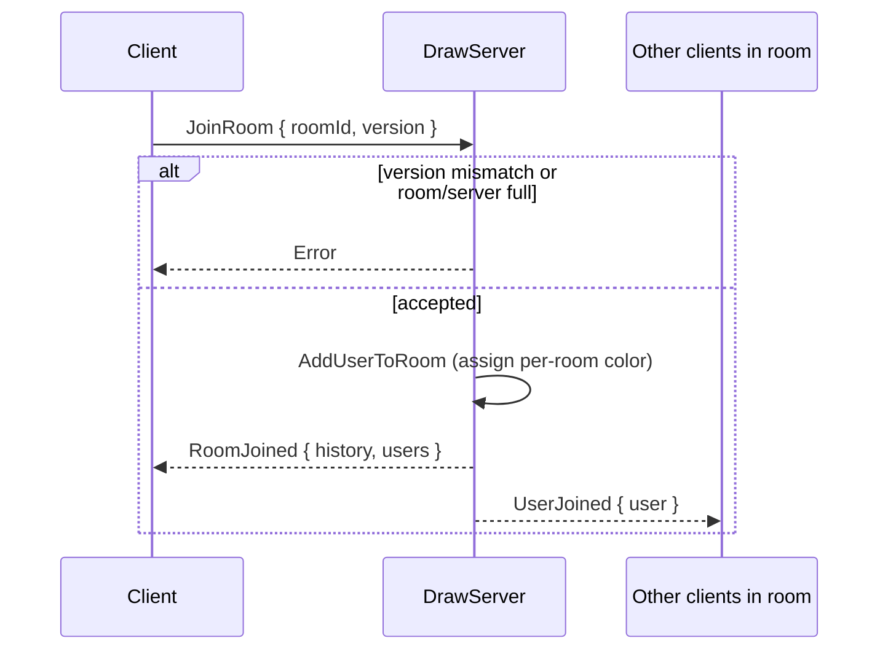
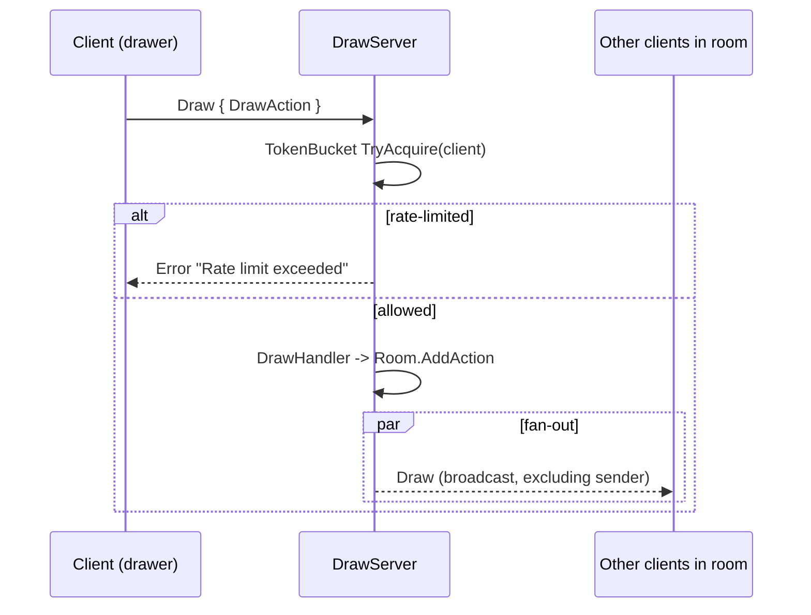
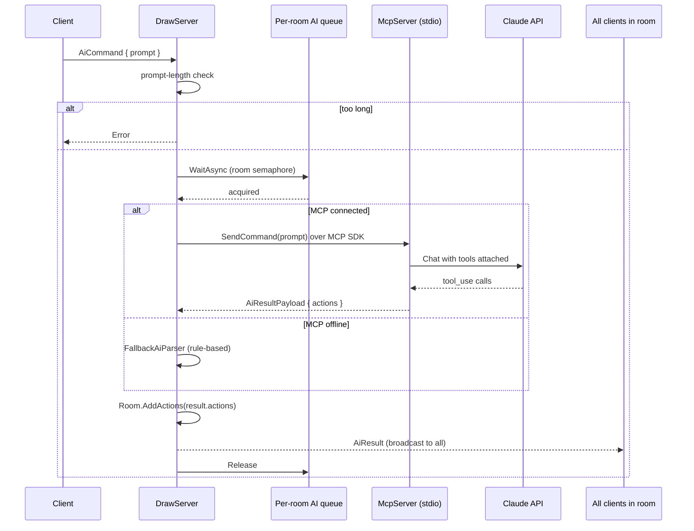

# NetDraw - Ứng dụng Vẽ Chung Qua Mạng

Đồ án môn **Lập Trình Mạng Căn Bản** - Trường ĐH Công Nghệ Thông Tin (UIT), ĐHQG-HCM.

## Mô tả

NetDraw là ứng dụng vẽ cộng tác real-time qua mạng TCP, cho phép nhiều người dùng cùng vẽ trên một canvas chung. Tích hợp MCP Server (Model Context Protocol) để hỗ trợ vẽ bằng lệnh AI ngôn ngữ tự nhiên (tiếng Việt/Anh).

## Kiến trúc hệ thống

```
┌─────────────┐                        ┌──────────────┐
│  Client 1   │◄──── TCP Socket ──────►│              │
│  (WPF)      │                        │  DrawServer  │
└─────────────┘                        │  (port 5000) │
                                       │              │     TCP
┌─────────────┐                        │  - Room mgmt │◄──────────►┌────────────┐
│  Client 2   │◄──── TCP Socket ──────►│  - Broadcast │            │ MCP Server │
│  (WPF)      │                        │  - History   │            │ (port 5001)│
└─────────────┘                        │  - AI relay  │            │            │
                                       │              │            │ - AI Parse │
┌─────────────┐                        │              │            │ - Claude   │
│  Client N   │◄──── TCP Socket ──────►│              │            │   API      │
│  (WPF)      │                        └──────────────┘            └────────────┘
└─────────────┘
```

## Công nghệ sử dụng

### Runtime & ngôn ngữ
| Thành phần | Công nghệ |
|---|---|
| Ngôn ngữ | C# 12 trên **.NET 8 LTS** |
| Server / McpServer | `net8.0` (Console) |
| Client | `net8.0-windows` (WPF, MVVM thuần) |

### Giao tiếp mạng
| Lớp | Công nghệ / Cơ chế |
|---|---|
| Transport | TCP Socket (`System.Net.Sockets.TcpListener` / `TcpClient`) |
| Framing | **Lai (dual-format)**: NDJSON (`{...}\n`) **và** binary frame (magic `0xFE`, length-prefixed) — chọn theo byte đầu tiên |
| Binary envelope | 6 B header + 48 B envelope cố định (timestamp i64 BE, senderId u32, roomHash xxhash32, sessionToken 32 B raw) |
| LAN discovery | UDP **multicast** 239.255.77.12:5099, multi-NIC bind (xử lý Hyper-V/WSL virtual switch) |
| Health endpoint | HTTP listener (mặc định `:5050/health`) cho load balancer |
| Resume / reconnect | Session token 32 B CSPRNG + grace window (mặc định 30 s) cho phép TCP đứt rồi reconnect không "rớt user" |

### Giao thức ứng dụng
| Lớp | Công nghệ |
|---|---|
| Serialization | **Newtonsoft.Json 13.0.4** (custom `DrawActionConverter` polymorphic theo `"type"`) |
| Envelope | 2 pha parse — envelope-only trước, payload typed sau (`MessageEnvelope.DeserializePayload<T>`) |
| Authn per-message | `CryptographicOperations.FixedTimeEquals` (chống timing attack) trên session token |
| Rate limiting | Token bucket per-client (capacity 200, refill 50/s, dùng `Stopwatch.GetTimestamp()` monotonic) |
| Authz per-message | Room-pinning (envelope.RoomId phải khớp room đã JoinRoom) + ownership check trên Move/Delete |
| File save format | `.ndraw` = ZIP archive (manifest.json + actions.json), atomic write `tmp → File.Move`, có zip-bomb cap |

### AI / MCP
| Lớp | Công nghệ |
|---|---|
| MCP runtime | **Anthropic.SDK 5.10.0** + **ModelContextProtocol 1.1.0** + **Microsoft.Extensions.AI 10.3.0** |
| Transport MCP | `StdioClientTransport` — server **spawn `NetDraw.McpServer` làm child process** qua **stdio JSON-RPC 2.0** (không phải TCP :5001 như doc cũ ghi) |
| Tool dispatch | `[McpServerTool]` attribute + reflection → schema tự sinh; `UseFunctionInvocation()` tự loop `tool_use → tool_result` cho Claude |
| Model | `claude-sonnet-4-5-20250929`, max 16k tokens output |
| Fallback | `FallbackAiParser` (rule-based) khi không có API key hoặc MCP init fail — pipeline AI **không bao giờ block** message loop nhờ `Task.Run` fire-and-forget + per-room `SemaphoreSlim(1,1)` có timeout 2 phút |
| Prompt budget | Length cap 4 KiB UTF-8 + per-user cooldown 5 s + scrub regex (sk-ant-*, gh*_*, base64url ≥40) trước khi log |

### UI
| Lớp | Công nghệ |
|---|---|
| Pattern | MVVM + `EventAggregator` (pub/sub cross-VM) |
| Rendering pen | **Catmull-Rom → cubic Bezier** (`B1 = P1 + (P2−P0)/6`, `B2 = P2 − (P3−P1)/6`) qua `StreamGeometry.Freeze()` |
| Cursor remote | `DoubleAnimation` 90 ms + `CubicEase` (cố tình **không dùng `DropShadowEffect`** vì rasterize/frame → giật) |
| File I/O | Bounded streaming (`BoundedReadStream`) bảo vệ zip-bomb |
| Logging | `Microsoft.Extensions.Logging` 9.0.0 + `Microsoft.Extensions.Hosting` 8.0.1 |

### Build & Test
| Loại | Công nghệ |
|---|---|
| Solution | `NetDraw.slnx` (XML solution, .NET 8) |
| Test framework | xUnit (`NetDraw.Shared.Tests`, `NetDraw.Server.Tests` — tổng 78 tests passing) |
| Wireshark dissector | `tools/wireshark/netdraw.lua` — parse cả NDJSON và binary frame |
| Design docs | `docs/design/` — binary-frame, session-token, mcp-v2, udp-cursor-channel, lan-discovery, load-balancer, tls-in-house |

## Cấu trúc Solution

```
NetDraw/
├── NetDraw.sln
│
├── NetDraw.Shared/                 # Thư viện dùng chung (DTO + Protocol)
│   ├── Protocol/
│   │   ├── MessageType.cs          # Enum các loại message
│   │   ├── MessageEnvelope.cs      # Bọc/parse message + payload polymorphic
│   │   ├── NetMessage.cs           # Factory tạo message typed
│   │   └── Payloads/               # Các payload chuyên biệt (Draw, Chat, AI, User...)
│   └── Models/
│       ├── Actions/                # DrawActionBase + PenAction, LineAction, ShapeAction, TextAction...
│       │   └── DrawActionConverter.cs  # JSON polymorphic converter
│       └── RoomInfo.cs             # Room, UserInfo, Cursor, DrawingFile
│
├── NetDraw.Server/                 # TCP Server (port 5000)
│   ├── Program.cs                  # Entry point + DI wiring (env var only API key)
│   ├── DrawServer.cs               # Listener, accept loop, MCP bootstrap
│   ├── ByteFrameBuffer.cs          # Buffer byte-mode (giữ raw bytes đến frame boundary)
│   ├── ClientHandler.cs            # Mỗi client 1 instance — dual-format framer (NDJSON + binary 0xFE)
│   ├── Room.cs                     # State phòng: user list, history, undo stack
│   ├── Ai/
│   │   └── FallbackAiParser.cs     # Parser rule-based khi MCP offline
│   ├── Pipeline/
│   │   ├── IMessageHandler.cs      # Contract xử lý từng MessageType
│   │   └── MessageDispatcher.cs    # Route message → handler phù hợp
│   ├── Handlers/                   # Xử lý nghiệp vụ theo từng loại message
│   │   ├── RoomHandler.cs          # Join/Leave/Snapshot
│   │   ├── DrawHandler.cs          # Draw, DrawPreview, Clear, Undo, Redo
│   │   ├── ObjectHandler.cs        # MoveObject, DeleteObject
│   │   ├── PresenceHandler.cs      # Cursor move, live preview
│   │   ├── ChatHandler.cs          # ChatMessage
│   │   └── AiHandler.cs            # AiCommand — fire-and-forget sang MCP (không block loop)
│   └── Services/
│       ├── IRoomService / RoomService     # Quản lý nhiều phòng + broadcast (strip token trước fan-out)
│       ├── IClientRegistry / ClientRegistry
│       ├── SessionTokenStore             # Issue/Claim 32-byte token, orphan grace window
│       ├── TokenBucketRateLimiter        # Per-client bucket, race-safe Forget()
│       ├── BeaconService                 # UDP multicast LAN discovery (multi-NIC)
│       ├── HttpHealthServer              # Endpoint /health cho load balancer
│       └── IMcpClient / McpClient         # MCP qua stdio JSON-RPC (Anthropic.SDK + ModelContextProtocol)
│
├── NetDraw.Client/                 # WPF Client (MVVM)
│   ├── App.xaml/cs                 # Composition root + DI manual
│   ├── MainWindow.xaml/cs          # Shell view + chuột/bàn phím/pan/zoom
│   ├── ViewModels/
│   │   ├── MainViewModel.cs        # Coordinator, xử lý message nhận từ server
│   │   ├── CanvasViewModel.cs      # State canvas (actions, zoom, pan)
│   │   ├── ToolbarViewModel.cs     # Tool hiện tại, màu, size, opacity
│   │   ├── ChatViewModel.cs        # Lịch sử chat
│   │   └── UserListViewModel.cs    # Danh sách user online
│   ├── Services/
│   │   ├── INetworkService / NetworkService   # TCP client wrapper
│   │   └── IFileService / FileService         # Save/Open .ndr + export PNG
│   ├── Drawing/
│   │   ├── ICanvasRenderer / WpfCanvasRenderer  # DrawAction → WPF UIElement (Bezier-smooth pen)
│   │   ├── HistoryManager.cs       # Undo/Redo stack
│   │   └── RemotePresenceManager.cs # Con trỏ/tên user khác (animated, no DropShadow)
│   ├── Infrastructure/
│   │   ├── ViewModelBase.cs        # INotifyPropertyChanged helper
│   │   ├── RelayCommand.cs         # ICommand adapter
│   │   └── EventAggregator.cs      # Pub/sub cross-VM
│   ├── ColorPickerDialog.xaml/cs       # Bảng chọn màu (RGB slider, HEX, 39+ quick colors)
│   ├── ImageImportDialog.xaml/cs       # Import ảnh + bộ lọc (đen trắng, sepia, sketch...)
│   ├── TemplateDialog.xaml/cs          # Chọn template mẫu (grid, wireframe, flowchart...)
│   ├── TextInputDialog.xaml/cs         # Dialog nhập text
│   └── InputDialog.xaml/cs             # Dialog nhập chung
│
└── NetDraw.McpServer/              # MCP tool host (child process qua stdio JSON-RPC)
    ├── Program.cs                  # `Host.CreateApplicationBuilder().AddMcpServer().WithStdioServerTransport().WithToolsFromAssembly()`
    │                               # Log đẩy hoàn toàn về stderr — stdout reserved cho RPC frames
    └── DrawingTools.cs             # 60+ static methods `[McpServerTool]` — schema sinh tự động qua reflection
                                    # (shape primitives, arc/bezier/polygon, text, composite cat/house/tree…)
```

> **Lưu ý**: `NetDraw.McpServer` **không** phải là TCP server độc lập trên port 5001 (như doc cũ mô tả).
> `NetDraw.Server` spawn nó làm **child process** và giao tiếp qua **stdin/stdout** theo chuẩn MCP JSON-RPC 2.0
> — vì thế bạn không cần chạy nó bằng tay; chỉ cần set `ANTHROPIC_API_KEY` là server tự khởi động child process.

## Giao thức truyền thông

Giao thức sử dụng **JSON + newline (`\n`) delimiter** trên TCP Socket.

### Cấu trúc message

```json
{
  "type": "DrawLine",
  "senderId": "f58015ea",
  "senderName": "User818",
  "roomId": "room1",
  "timestamp": 1712419200000,
  "payload": { ... }
}
```

### Các loại message chính

| Type | Hướng | Mô tả |
|---|---|---|
| `JoinRoom` | Client → Server | Yêu cầu vào phòng |
| `RoomJoined` | Server → Client | Xác nhận đã vào phòng |
| `UserJoined` / `UserLeft` | Server → All | Thông báo user vào/rời |
| `DrawLine` | Client ↔ Server | Vẽ nét bút / đường thẳng / mũi tên |
| `DrawShape` | Client ↔ Server | Vẽ hình (rect, circle, ellipse, triangle, star) |
| `DrawText` | Client ↔ Server | Chèn text |
| `Erase` | Client ↔ Server | Xóa (eraser) |
| `ClearCanvas` | Client ↔ Server | Xóa toàn bộ canvas |
| `CanvasSnapshot` | Server → Client | Gửi lịch sử vẽ cho user mới join |
| `DrawingUpdate` | Client → Server → All | Live preview nét đang vẽ (real-time) |
| `CursorMove` | Client → Server → All | Vị trí chuột real-time |
| `MoveObject` | Client ↔ Server | Di chuyển đối tượng đã vẽ |
| `DeleteObject` | Client ↔ Server | Xóa đối tượng cụ thể |
| `Undo` / `Redo` | Client ↔ Server | Hoàn tác / Làm lại |
| `ChatMessage` | Client ↔ Server | Tin nhắn chat |
| `AiCommand` | Client → Server → MCP | Lệnh vẽ AI |
| `AiDrawResult` | MCP → Server → All | Kết quả AI trả về (danh sách DrawAction) |

## Sequence diagrams

### Join room



### Draw broadcast



### AI prompt flow



## Hướng dẫn chạy

### Yêu cầu

- .NET 8 SDK trở lên
- Windows (WPF client yêu cầu Windows)

### Bước 1: Build

```bash
cd D:\NT106.Q21.ANTN
dotnet build
```

### Bước 2: Chạy

Chỉ cần **2 process**: Server và Client. McpServer được Server tự spawn làm child process qua stdio.

```bash
# Terminal 1: Draw Server (tự spawn McpServer nếu có ANTHROPIC_API_KEY)
dotnet run --project NetDraw.Server

# Terminal 2..N: Client (mở nhiều terminal để test multi-user)
dotnet run --project NetDraw.Client
```

### Bước 3: Sử dụng

1. Nhập IP server, port (mặc định `127.0.0.1:5000`), tên người dùng
2. Nhấn **Kết nối**
3. Chọn phòng và nhấn **Vào**
4. Bắt đầu vẽ!

### Tùy chọn: AI qua Claude API

Để sử dụng AI nâng cao thay vì rule-based parser, set **environment variable** trước khi chạy `NetDraw.Server`:

```bash
# Windows (CMD)
set ANTHROPIC_API_KEY=sk-ant-xxxxx
dotnet run --project NetDraw.Server

# Windows (PowerShell)
$env:ANTHROPIC_API_KEY = "sk-ant-xxxxx"
dotnet run --project NetDraw.Server

# Linux / macOS
ANTHROPIC_API_KEY=sk-ant-xxxxx dotnet run --project NetDraw.Server
```

Tên env var legacy `CLAUDE_API_KEY` vẫn được nhận để tương thích.

> **Bảo mật**: KHÔNG truyền API key qua command-line argument (`dotnet run -- 5000 sk-ant-...`).
> Trên Linux/macOS `ps aux` xuất full argv ra mọi user trên máy → leak key. Server đã từ chối nhận key qua argv kể từ bản hardening.

Server sẽ log `Claude API key: present` khi khởi động thành công. Nếu không có key thì log `(none — fallback parser only)` và dùng `FallbackAiParser` rule-based.

### Độ bền của pipeline AI

Pipeline AI được thiết kế để **không bao giờ block** các luồng khác (cursor, draw, chat) của user gửi lệnh AI:

| Cơ chế | Vị trí | Mục đích |
|---|---|---|
| Fire-and-forget `Task.Run` | `AiHandler.HandleAsync` | Trả `Task.CompletedTask` ngay, xử lý AI nền |
| SemaphoreSlim (1 slot) | `McpClient` | 1 request đang bay trên TCP pipe tại 1 thời điểm |
| Client timeout 60 s | `McpClient.ReadLineAsync` | Không đợi AI chậm vô thời hạn |
| Close socket on timeout | `McpClient` | Bỏ response cũ kẹt lại, tránh mismatch request/response |
| Auto-reconnect loop | `McpClient.MaintainConnectionLoopAsync` | Tự kết nối lại khi MCP restart |
| `Interlocked.Exchange` connection | `McpDrawServer` | Thay connection cũ khi DrawServer reconnect |
| Server timeout 90 s | `CallClaudeApiAsync` | `HttpClient.Timeout` bảo vệ Claude API call |
| Fallback rule-based | `FallbackAiParser` + `EnhancedAiParser` | Luôn có kết quả dù MCP/Claude lỗi |

### Log pipeline AI

Các log có tiền tố rõ ràng, in kèm thời gian (`ms`) theo từng giai đoạn:

```
[AI] ▶ "vẽ hình tròn đỏ"  sender=5fc12013  room=default  mcp=connected
[AI]   → forwarding to MCP server…
[MCP] Waiting for send lock…  (command: "vẽ hình tròn đỏ")
[MCP] → Sending to McpServer…
[MCP]   sent in 2 ms, waiting for response…
[McpServer] ▶ "vẽ hình tròn đỏ"  sender=5fc12013  room=default
[McpServer]   → calling Claude API…
[McpServer]   ← Claude API returned in 3421 ms  (1 actions)
[McpServer] ✔ sent 1 action(s) in 3445 ms total
[MCP] ← Response received in 3460 ms
[MCP]   parsed: 1 action(s)
[AI]   ← MCP replied in 3462 ms  actions=1
[AI] ✔ done in 3475 ms  → 1 action(s) broadcast
[Client] AiResult received: actions=1  error=none
```

## Kết nối mạng & Triển khai

### Tổng quan mô hình mạng

```
                        ┌──────────────────────────────────┐
                        │         INTERNET                 │
                        │                                  │
  Mạng A (LAN)         │         NAT / Firewall           │        Mạng B (LAN)
┌─────────────────┐     │     ┌──────────────────┐         │    ┌─────────────────┐
│ Client A        │     │     │   Router A       │         │    │ Client B        │
│ 192.168.1.10    │◄────┼────►│ Public IP:       │         │    │ 192.168.0.20    │
│                 │     │     │ 113.160.x.x      │         │    │                 │
└─────────────────┘     │     └──────────────────┘         │    └────────┬────────┘
                        │              ▲                   │             │
┌─────────────────┐     │              │ Port Forwarding   │             │
│ Server          │     │              │ 5000 → 192.168.1.5│             │
│ 192.168.1.5     │◄────┼──────────────┘                   │             │
│ Port 5000       │     │                                  │             │
└─────────────────┘     │     ┌──────────────────┐         │             │
                        │     │   Router B       │◄────────┼─────────────┘
                        │     │ Public IP:       │         │
                        │     │ 171.252.x.x      │         │
                        │     └──────────────────┘         │
                        └──────────────────────────────────┘

Client B kết nối đến: 113.160.x.x:5000 (Public IP của Router A)
Router A forward port 5000 → 192.168.1.5:5000 (Server trong LAN A)
```

### Các khái niệm mạng cơ bản

#### 1. IP Address (Địa chỉ IP)

| Loại | Dải địa chỉ | Phạm vi | Ví dụ |
|---|---|---|---|
| **Private IP** (LAN) | `10.0.0.0/8`, `172.16.0.0/12`, `192.168.0.0/16` | Chỉ trong mạng nội bộ | `192.168.1.5` |
| **Public IP** (WAN) | Tất cả IP khác | Toàn cầu, duy nhất | `113.160.45.123` |
| **Loopback** | `127.0.0.0/8` | Chỉ trên chính máy đó | `127.0.0.1` (localhost) |

- Mỗi thiết bị trong LAN có **Private IP** riêng (do router/DHCP cấp)
- Cả mạng LAN chia sẻ chung **1 Public IP** (do ISP cấp cho router)
- Máy bên ngoài **KHÔNG thể** truy cập Private IP trực tiếp → cần **Port Forwarding** hoặc **Tunneling**

```bash
# Xem Private IP của máy
ipconfig                          # Windows
ifconfig / ip addr                # Linux/Mac

# Xem Public IP
curl ifconfig.me                  # hoặc truy cập whatismyip.com
```

#### 2. Port (Cổng)

- Mỗi ứng dụng mạng lắng nghe trên một **port** (0-65535)
- Port giống "số phòng" trong một tòa nhà (IP = địa chỉ tòa nhà)
- NetDraw dùng: **5000** (Draw Server), **5001** (MCP Server)

| Dải port | Loại | Ghi chú |
|---|---|---|
| 0 - 1023 | Well-known | HTTP(80), HTTPS(443), SSH(22), FTP(21) |
| 1024 - 49151 | Registered | MySQL(3306), PostgreSQL(5432) |
| 49152 - 65535 | Dynamic/Private | Tự do sử dụng |

#### 3. TCP vs UDP

NetDraw sử dụng **TCP** vì cần đảm bảo dữ liệu vẽ không bị mất:

| Đặc điểm | TCP | UDP |
|---|---|---|
| Kết nối | Connection-oriented (3-way handshake) | Connectionless |
| Tin cậy | Đảm bảo gói tin đến đúng thứ tự, không mất | Không đảm bảo |
| Tốc độ | Chậm hơn (do overhead) | Nhanh hơn |
| Use case | Chat, file transfer, web, **vẽ cộng tác** | Game, video call, streaming |

```
TCP 3-Way Handshake:
Client ──── SYN ────► Server      (1) Client gửi yêu cầu kết nối
Client ◄── SYN+ACK ── Server     (2) Server chấp nhận
Client ──── ACK ────► Server      (3) Kết nối được thiết lập
Client ◄──── DATA ───► Server     Bắt đầu trao đổi dữ liệu
```

#### 4. NAT (Network Address Translation)

NAT là cơ chế router dùng để **chuyển đổi Private IP ↔ Public IP**:

```
Gói tin đi ra (LAN → Internet):
  Src: 192.168.1.5:5000  →  Router NAT  →  Src: 113.160.x.x:54321
  (Private IP)                              (Public IP, port ngẫu nhiên)

Gói tin đi vào (Internet → LAN):
  Dst: 113.160.x.x:54321  →  Router NAT  →  Dst: 192.168.1.5:5000
  (Public IP)                                (Private IP, tra bảng NAT)
```

- NAT hoạt động tốt cho **kết nối đi ra** (client → server ngoài)
- Nhưng **chặn kết nối đi vào** (bên ngoài → server trong LAN) vì router không biết forward đến máy nào
- → Cần **Port Forwarding** để "mở cửa" cho kết nối từ ngoài vào

#### 5. Firewall

- Phần mềm/phần cứng **lọc traffic** vào/ra dựa trên rules
- Windows Firewall mặc định **chặn kết nối đến** (inbound)
- Cần mở port 5000 trong Firewall để client khác kết nối được

---

### Cách 1: Cùng mạng LAN (đơn giản nhất)

Tất cả máy kết nối cùng WiFi hoặc cùng mạng Ethernet.

```
Server: chạy trên máy A (192.168.1.5)
Client: nhập IP = 192.168.1.5, Port = 5000
```

**Mở port Firewall trên máy chạy Server:**

```bash
# Windows - mở port 5000 cho TCP (chạy CMD với quyền Admin)
netsh advfirewall firewall add rule name="NetDraw Server" dir=in action=allow protocol=TCP localport=5000

# Kiểm tra
netsh advfirewall firewall show rule name="NetDraw Server"

# Xóa rule khi không cần
netsh advfirewall firewall delete rule name="NetDraw Server"
```

### Cách 2: Port Forwarding (qua Internet, không cần phần mềm thêm)

Khi server và client ở **khác mạng** (khác nhà, khác WiFi):

**Bước 1: Cấu hình Port Forwarding trên Router**

```
1. Truy cập trang quản lý router: http://192.168.1.1 (hoặc 192.168.0.1)
   - Tài khoản mặc định thường: admin/admin hoặc ghi dưới đáy router

2. Tìm mục: Port Forwarding / Virtual Server / NAT

3. Thêm rule:
   ┌──────────────────────────────────────────┐
   │ Service Name:  NetDraw                   │
   │ Protocol:      TCP                       │
   │ External Port: 5000                      │
   │ Internal IP:   192.168.1.5 (IP máy server)│
   │ Internal Port: 5000                      │
   │ Enabled:       ✓                         │
   └──────────────────────────────────────────┘

4. Lưu và khởi động lại router nếu cần
```

**Bước 2: Tìm Public IP**

```bash
curl ifconfig.me
# Hoặc truy cập: https://whatismyip.com
# Ví dụ kết quả: 113.160.45.123
```

**Bước 3: Client kết nối**

```
IP: 113.160.45.123 (Public IP của router chạy server)
Port: 5000
```

**Lưu ý quan trọng:**
- ISP Việt Nam (VNPT, Viettel, FPT) có thể dùng **CGNAT** (Carrier-Grade NAT) → Public IP bị chia sẻ giữa nhiều khách hàng → Port Forwarding không hoạt động
- Kiểm tra: nếu IP trên router khác với IP trên whatismyip.com → đang bị CGNAT
- Giải pháp: gọi ISP xin **IP tĩnh** hoặc dùng Cách 3/4

### Cách 3: Ngrok Tunnel (đơn giản, miễn phí, không cần cấu hình router)

[Ngrok](https://ngrok.com) tạo tunnel từ Internet → máy local, bypass NAT và Firewall.

```
┌────────┐       ┌──────────────┐       ┌────────────┐
│ Client │──────►│ Ngrok Cloud  │──────►│ Server     │
│ (Bất kỳ│       │ (tunnel)     │       │ (localhost) │
│  đâu)  │       │              │       │ port 5000  │
└────────┘       └──────────────┘       └────────────┘
```

**Bước 1: Cài đặt Ngrok**

```bash
# Tải từ: https://ngrok.com/download
# Hoặc dùng winget/choco:
winget install ngrok
choco install ngrok
```

**Bước 2: Đăng ký và xác thực**

```bash
# Đăng ký tại ngrok.com, lấy authtoken
ngrok config add-authtoken <your-token>
```

**Bước 3: Tạo tunnel**

```bash
# Chạy sau khi đã start NetDraw Server
ngrok tcp 5000
```

Output:
```
Session Status    online
Forwarding        tcp://0.tcp.ap.ngrok.io:12345 -> localhost:5000
```

**Bước 4: Client kết nối**

```
IP:   0.tcp.ap.ngrok.io
Port: 12345
```

### Cách 4: Cloud VPS (chuyên nghiệp, ổn định)

Triển khai Server lên VPS (Virtual Private Server) có Public IP tĩnh.

```bash
# Trên VPS (Ubuntu/Debian):
# 1. Cài .NET 8 Runtime
wget https://dot.net/v1/dotnet-install.sh
chmod +x dotnet-install.sh
./dotnet-install.sh --runtime dotnet --version 8.0.0

# 2. Copy project lên VPS (dùng scp hoặc git)
scp -r NetDraw.Server/ NetDraw.Shared/ user@vps-ip:~/netdraw/
scp -r NetDraw.McpServer/ user@vps-ip:~/netdraw/

# 3. Build và chạy
cd ~/netdraw
dotnet build
dotnet run --project NetDraw.Server &
dotnet run --project NetDraw.McpServer &

# 4. Mở firewall trên VPS
sudo ufw allow 5000/tcp
```

**Nhà cung cấp VPS phổ biến:** AWS EC2, Google Cloud, Azure, DigitalOcean, Vultr, Linode

### Cách 5: Tailscale / ZeroTier (VPN Mesh - P2P)

Tạo mạng LAN ảo qua Internet, mỗi máy được cấp IP riêng trong mạng ảo.

```
┌────────────┐                          ┌────────────┐
│ Máy A      │     Tailscale Network    │ Máy B      │
│ LAN: 192.168.1.5│   (mạng ảo)       │ LAN: 192.168.0.20│
│ Tailscale: │◄────────────────────────►│ Tailscale: │
│ 100.64.0.1 │    Encrypted P2P tunnel  │ 100.64.0.2 │
└────────────┘                          └────────────┘
```

```bash
# Cài Tailscale: https://tailscale.com/download
# Đăng nhập trên cả 2 máy
tailscale up

# Xem IP Tailscale
tailscale ip

# Client kết nối bằng IP Tailscale của máy chạy Server
# IP: 100.64.0.1, Port: 5000
```

### So sánh các phương pháp

| Phương pháp | Độ khó | Chi phí | Tốc độ | Ổn định | Phù hợp |
|---|---|---|---|---|---|
| LAN | Rất dễ | Miễn phí | Nhanh nhất | Cao | Demo, test |
| Port Forwarding | Trung bình | Miễn phí | Nhanh | Cao | Biết cấu hình router |
| Ngrok | Dễ | Miễn phí (giới hạn) | Trung bình | Trung bình | Demo nhanh, không cần router |
| Cloud VPS | Khó | Có phí ($5-10/tháng) | Nhanh | Rất cao | Production, triển khai thực |
| Tailscale/ZeroTier | Dễ | Miễn phí | Nhanh (P2P) | Cao | Nhóm nhỏ, không cần server |

### Xử lý sự cố kết nối

```bash
# 1. Kiểm tra server đang chạy
netstat -an | findstr 5000

# 2. Kiểm tra firewall
netsh advfirewall firewall show rule name=all | findstr 5000

# 3. Kiểm tra kết nối từ client
# Dùng telnet hoặc Test-NetConnection (PowerShell)
Test-NetConnection -ComputerName 192.168.1.5 -Port 5000

# 4. Kiểm tra route
tracert 192.168.1.5        # Windows
traceroute 192.168.1.5     # Linux/Mac

# 5. Kiểm tra port forwarding hoạt động
# Từ bên ngoài mạng:
Test-NetConnection -ComputerName 113.160.x.x -Port 5000
```

## Tính năng

### Công cụ vẽ
- Bút vẽ tự do (Pen)
- Bút thư pháp (Calligraphy) - nét dày/mỏng theo hướng vẽ
- Bút highlight (Highlighter) - bán trong suốt, nét rộng
- Bút phun sơn (Spray) - hiệu ứng airbrush
- Đường thẳng (Line)
- Mũi tên (Arrow) - đường thẳng có đầu mũi tên
- Hình chữ nhật, hình tròn, hình elip, tam giác, ngôi sao
- Chèn text
- Tẩy (Eraser)

### Tùy chỉnh nét vẽ
- Chọn màu nhanh (14 màu) + bảng chọn màu tùy chỉnh (RGB slider, HEX, 39+ quick colors)
- Điều chỉnh kích thước nét (1-30)
- Điều chỉnh độ trong suốt (Opacity 10%-100%)
- Kiểu nét: Nét liền, Nét đứt, Nét chấm (Dash Style)
- Tô màu nền hình (Fill)

### Thao tác Canvas
- Chọn / Di chuyển đối tượng (Select tool)
- Xóa đối tượng đã chọn (Delete)
- Undo / Redo (hỗ trợ undo theo nhóm cho template)
- Xóa toàn bộ canvas
- **Pan** đa dạng: chuột phải kéo / chuột giữa kéo / Space + chuột trái kéo (Figma-style)
- **Zoom** bằng scroll wheel (20%-500%)
- **Nét vẽ mượt**: pen/highlighter dùng Catmull-Rom → Bezier cubic (không gãy góc)
- **Con trỏ chuột tùy chỉnh**: ring co giãn theo stroke size + zoom, đổi màu theo tool
- Lưu / Mở project (.ndr) - lưu toàn bộ bản vẽ bao gồm ảnh import
- Xuất ảnh PNG

### Hình ảnh & Template
- Import ảnh (PNG, JPG, BMP, GIF, TIFF) với bộ lọc:
  - Gốc, Đen trắng (Grayscale), Sepia (Cổ điển), Âm bản (Invert)
  - Tương phản cao (High Contrast), Phác thảo (Sketch - edge detection)
  - Điều chỉnh kích thước 10%-200%
- 10 template mẫu:
  - Grid (lưới ô vuông), Ruled Lines (giấy kẻ dòng), Dot Grid (lưới chấm)
  - Coordinate (hệ tọa độ XY), Storyboard (6 ô), Wireframe (giao diện web)
  - Flowchart (lưu đồ), Music Sheet (khuông nhạc), Calendar (lịch tháng)
  - Comic (khung truyện tranh)

### Mạng & Cộng tác
- Kết nối TCP Socket real-time
- Hệ thống phòng vẽ (tạo/join/leave)
- Đồng bộ canvas giữa tất cả user trong phòng
- **Live Drawing Preview** - user khác thấy nét vẽ đang hình thành real-time
- **Con trỏ remote mượt** - dùng `DoubleAnimation` + `CubicEase` (không còn giật, không DropShadow)
- User mới join nhận lại toàn bộ bản vẽ (canvas snapshot)
- Danh sách user online (hiển thị màu riêng mỗi user)
- Chat trong phòng (có feedback từ AI: số đối tượng đã vẽ / lỗi)

### AI Drawing (MCP)
- Gõ lệnh bằng tiếng Việt hoặc tiếng Anh
- Hỗ trợ hình đơn: `vẽ hình tròn màu đỏ ở giữa`
- Hỗ trợ vật thể: `vẽ ngôi nhà`, `vẽ cây`, `vẽ mặt trời`, `vẽ xe hơi`
- Hỗ trợ scene phức tạp: `vẽ phong cảnh có mặt trời mây cây`
- Hỗ trợ đặc biệt: `vẽ cầu vồng`, `vẽ mặt cười`, `vẽ hoa`, `vẽ trái tim`

## Phím tắt

| Phím | Chức năng |
|---|---|
| V | Chọn / Di chuyển |
| P | Bút vẽ |
| L | Đường thẳng |
| A | Mũi tên |
| R | Hình chữ nhật |
| C | Hình tròn |
| E | Hình elip |
| T | Tam giác |
| H | Bút highlight |
| X | Tẩy |
| Delete | Xóa đối tượng đã chọn |
| Ctrl+Z | Undo |
| Ctrl+Y | Redo |
| Ctrl+S | Lưu project |
| Ctrl+O | Mở project |
| Ctrl+0 | Reset zoom |
| Scroll wheel | Zoom in/out |
| Chuột phải kéo | Pan canvas |
| Chuột giữa kéo | Pan canvas (middle-button) |
| Space + chuột trái kéo | Pan canvas (Figma-style) |

## Phân công nhóm (3 thành viên)

| Thành viên | Module | Nhiệm vụ chính |
|---|---|---|
| TV1 | Server | TCP Server, quản lý phòng, broadcast, protocol, xử lý kết nối |
| TV2 | Client | Giao diện WPF, canvas vẽ, toolbar, rendering, UX |
| TV3 | MCP + AI | MCP Server, AI parser, tích hợp Claude API, chat, shared models |

## Ví dụ lệnh AI

```
vẽ hình tròn màu đỏ ở giữa
vẽ hình vuông xanh dương to ở góc trái trên
vẽ ngôi nhà ở giữa
vẽ mặt trời ở góc phải trên
vẽ cây ở bên trái
vẽ phong cảnh có mặt trời mây cây nhà
vẽ cầu vồng
vẽ mặt cười vàng
vẽ hoa hồng ở giữa
vẽ trái tim đỏ
vẽ xe hơi màu xanh
draw red circle at center
draw blue rectangle big
```
