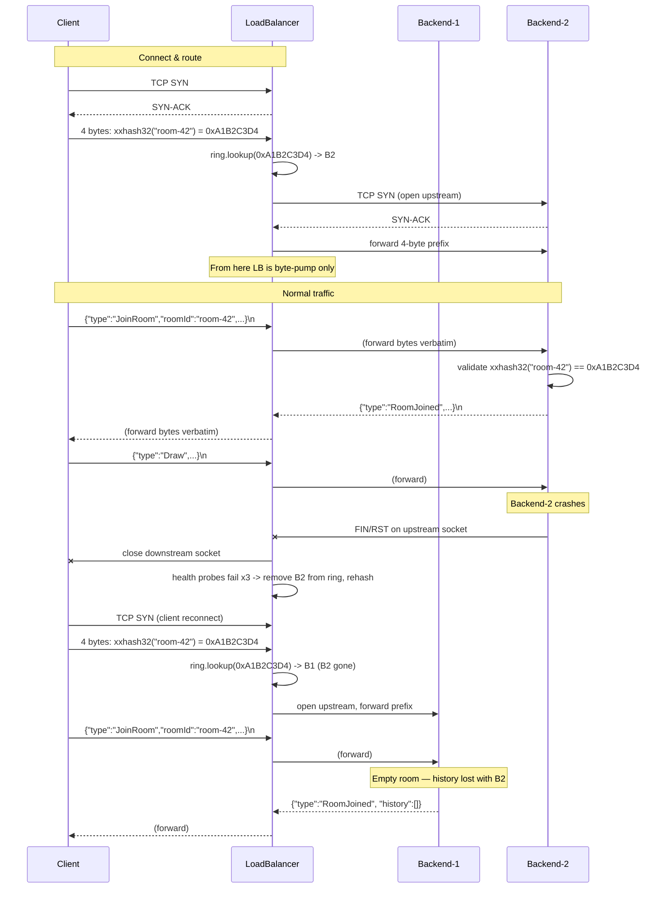

# Load Balancer (L4, consistent hashing on room-id)

## Elevator

Today: one `NetDraw.Server` process owns every room. A client opens a TCP connection
to it, sends a `JoinRoom` JSON frame, and the server keeps the room's `DrawAction`
history in memory until the process dies. Single point of failure, single point of
CPU/memory.

After: N `NetDraw.Server` backends sit behind a small `NetDraw.LoadBalancer`
process. The client TCP-connects to the LB, prepends a 4-byte `xxhash32(roomId)`
prefix to its very first frame, and the LB uses that prefix to pick a backend off
a consistent-hashing ring. Once routed, the LB is a dumb byte pump in both
directions for the lifetime of the connection. Backends never talk to each other.
The LB never parses JSON for routing — only the 4 prefix bytes.

What this buys: rooms are sharded across backends, so the cluster's aggregate
capacity scales with N, and one backend dying only kills the rooms it owned (not
all rooms). What this does not buy: any individual room is no more durable than
before, because room history is still in-memory on a single backend. See "Failure
semantics" below.

## Architecture



The LB has three independent surfaces:

1. **L4 forward listener** (default port `5500`) — accepts client TCP, opens an
   upstream TCP per accepted connection, runs two `Stream.CopyToAsync` pumps.
2. **Health prober** (background loop) — HTTP GET `/health` to each backend
   every 2 s, mutates the ring on threshold crossings.
3. **/stats HTTP listener** (default port `5550`) — read-only JSON dump of ring
   state and counters, modelled on the existing `HttpHealthServer`.

## Routing protocol

A new 4-byte prefix sits OUTSIDE the existing newline-delimited JSON envelope.
It is the first thing the client writes, and the first thing the server (and LB)
reads, on every TCP connection.

```
+--------+--------+--------+--------+--------+--------+--------+---------------
|  H[31:24] H[23:16] H[15:8] H[7:0]  |  '{' '"' 't' 'y' 'p' 'e' '"' ':' ...
+--------+--------+--------+--------+--------+--------+--------+---------------
 \____ xxhash32(roomId), big-endian ____/  \_______ JSON envelope, '\n' delimited ___
```

`H = xxhash32(utf8(roomId), seed=0)` written in **network byte order
(big-endian)**. Hash input is the exact UTF-8 bytes of the `roomId` string the
client will put in the JSON envelope: no trim, no case-fold, no Unicode
normalization. The server applies the same byte-for-byte rule for validation, so
the two sides never disagree.

### Why xxhash32

- Tiny — fits in ~30 LOC of pure C# with no NuGet additions, satisfies the "no
  new packages" constraint.
- Uniform enough for a routing key (this is not a security context).
- Fast — about a GB/s on modern x86, and we only hash strings ≤ a few hundred
  bytes.
- Well-known wire format with reference vectors, so a client implementation in
  any language can interoperate.

CRC32 was the runner-up. It would also work; xxhash has better distribution on
short strings and is the standard pick for sharding keys.

### Implementation sketch (illustrative)

```csharp
public static class XxHash32
{
    private const uint P1 = 2654435761u;
    private const uint P2 = 2246822519u;
    private const uint P3 = 3266489917u;
    private const uint P4 =  668265263u;
    private const uint P5 =  374761393u;

    public static uint Hash(ReadOnlySpan<byte> data, uint seed = 0)
    {
        int len = data.Length;
        uint h;
        int i = 0;

        if (len >= 16)
        {
            uint v1 = seed + P1 + P2;
            uint v2 = seed + P2;
            uint v3 = seed;
            uint v4 = seed - P1;
            while (i <= len - 16)
            {
                v1 = Round(v1, BinaryPrimitives.ReadUInt32LittleEndian(data.Slice(i,     4)));
                v2 = Round(v2, BinaryPrimitives.ReadUInt32LittleEndian(data.Slice(i + 4, 4)));
                v3 = Round(v3, BinaryPrimitives.ReadUInt32LittleEndian(data.Slice(i + 8, 4)));
                v4 = Round(v4, BinaryPrimitives.ReadUInt32LittleEndian(data.Slice(i + 12,4)));
                i += 16;
            }
            h = RotL(v1, 1) + RotL(v2, 7) + RotL(v3, 12) + RotL(v4, 18);
        }
        else h = seed + P5;

        h += (uint)len;

        while (i <= len - 4)
        {
            h += BinaryPrimitives.ReadUInt32LittleEndian(data.Slice(i, 4)) * P3;
            h  = RotL(h, 17) * P4;
            i += 4;
        }
        while (i < len)
        {
            h += (uint)data[i] * P5;
            h  = RotL(h, 11) * P1;
            i++;
        }

        h ^= h >> 15; h *= P2;
        h ^= h >> 13; h *= P3;
        h ^= h >> 16;
        return h;
    }

    private static uint Round(uint acc, uint lane) { acc += lane * P2; acc = RotL(acc, 13); return acc * P1; }
    private static uint RotL(uint x, int r) => (x << r) | (x >> (32 - r));
}
```

This goes in `NetDraw.Shared/Util/XxHash32.cs` so client, LB, and server share
one implementation. `NetDraw.Shared.Tests` gets one round-trip test against the
known-vector `xxhash32("", seed=0) = 0x02CC5D05`.

### Server-side prefix read

`ClientHandler.ListenAsync` currently goes straight into a UTF-8 decoder loop.
The prefix lives strictly before any text decoding; mixing them is what creates
bugs. So we add a pre-handshake step before the loop:

```csharp
public async Task ListenAsync()
{
    uint? expectedPrefix = await ReadPrefixOrNull(_stream); // 4 raw bytes, or null on legacy
    // existing decoder loop unchanged
}
```

`ReadPrefixOrNull` peeks one byte. If it is `0x7B` (`{`), the connection is
legacy-mode (no prefix): the byte is fed back into the decoder buffer and the
loop runs as before. Otherwise three more bytes are read with `ReadExactlyAsync`
and combined as big-endian `uint32`.

Validation lives in `RoomHandler.HandleJoinAsync`, not in `ClientHandler`. When
the JoinRoom envelope arrives, the handler computes
`XxHash32.Hash(Encoding.UTF8.GetBytes(roomId))` and compares with the stashed
prefix. Mismatch → send `Error` with message
`"roomId hash does not match routing prefix"` and close. Legacy mode (no
prefix) skips the check.

### Backward-compat detection and its hole

The peek-for-`0x7B` rule is unambiguous in one direction (`{` is never the high
byte of a v1 prefix that the client intends as a hash, because the client picks
which mode to use). It is **not** unambiguous in the other direction: a v1
client whose `xxhash32(roomId)` happens to begin with `0x7B` will be
misidentified as legacy by the server's peek, the validation step is skipped,
and the connection proceeds as if v1 didn't exist. Probability per room ≈ 1/256
≈ 0.4%. Real consequence: the LB still routes such a connection correctly (LB
trusts the prefix bytes it sees on the wire), but the server's defence-in-depth
check is bypassed for that one connection. Documented as a known v1 limitation.

v2 of the protocol bumps `ProtocolVersion.Current` and makes the prefix
mandatory. Server then rejects any first-byte = `0x7B` connection. The
backwards-compat detection is removed entirely.

## Consistent-hashing ring

A standard `SortedDictionary<uint, BackendId>` ring with virtual nodes. Each
backend gets `NETDRAW_LB_VNODES` (default 100) entries on the ring, placed at
`xxhash32($"{backendId}#{vnodeIndex}")`. Routing a key = find the smallest ring
entry `>=` the key, wrapping to the first entry if no such entry exists.

```csharp
public sealed class HashRing
{
    private readonly SortedDictionary<uint, string> _ring = new();
    private readonly object _lock = new();
    private readonly int _vnodes;

    public HashRing(int vnodes) { _vnodes = vnodes; }

    public void Add(string backendId)
    {
        lock (_lock)
        {
            for (int i = 0; i < _vnodes; i++)
            {
                uint h = XxHash32.Hash(Encoding.UTF8.GetBytes($"{backendId}#{i}"));
                _ring[h] = backendId;
            }
        }
    }

    public void Remove(string backendId)
    {
        lock (_lock)
        {
            for (int i = 0; i < _vnodes; i++)
            {
                uint h = XxHash32.Hash(Encoding.UTF8.GetBytes($"{backendId}#{i}"));
                _ring.Remove(h);
            }
        }
    }

    public string? Lookup(uint key)
    {
        lock (_lock)
        {
            if (_ring.Count == 0) return null;
            foreach (var kv in _ring)        // SortedDictionary enumerates in key order
                if (kv.Key >= key) return kv.Value;
            return _ring.First().Value;      // wrap
        }
    }
}
```

`SortedDictionary` is `O(log N)` for mutation and `O(N)` for the linear lookup
above; both are fine at N ≈ 500 (5 backends × 100 vnodes). If the demo scales,
swap the lookup for binary search over a cached sorted-key array — interface
unchanged.

### Why 100 vnodes per backend

Load variance on a consistent-hashing ring drops as `1/√V` where `V` is the
total vnode count. With 100 vnodes per backend and 2–5 backends in the demo,
expected per-backend share variance is around 10%, which is fine for a
classroom workload. Below 50 vnodes the variance becomes visibly lumpy at this
scale; above 200 you're spending memory on a precision the rest of the system
can't observe. 100 is the conventional default in production consistent-hash
implementations.

### Add / remove behaviour

Adding a backend pulls roughly `1/N` of the keyspace off the existing backends
onto the new one. Removing a backend redistributes that backend's keyspace
across all survivors in proportion to their vnode counts. The LB does not
attempt to migrate live connections — see "Failure semantics".

## Health-check

A background `Task` per backend wakes every 2 seconds, issues `GET
http://{backend.host}:{backend.healthPort}/health` with a 1 s timeout, and
records pass/fail.

- 3 consecutive failures while a backend is `Healthy` → set to `Unhealthy` and
  remove from the ring.
- 3 consecutive successes while `Unhealthy` → re-add to the ring.

A 200 response with body `{ "status": "ok", ... }` is required for "pass". Any
non-200, timeout, connection refused, or malformed JSON counts as fail.

### Backend address format

`NETDRAW_BACKENDS` accepts entries of the form `host:tcpPort:healthPort`, comma
separated:

```
NETDRAW_BACKENDS=10.0.0.1:5000:5050,10.0.0.2:5000:5050,10.0.0.3:5000:5050
```

The third field is required because the existing server's `HEALTH_PORT` defaults
to `5050` and is per-process — running 3 backends on one host (the demo
topology) means each needs its own pair: `5000/5050`, `5001/5051`,
`5002/5052`. Making the LB infer the health port from the TCP port would hide
this from the operator.

If `:healthPort` is omitted, the LB falls back to `5050` and logs a warning.

### Race conditions

There are two real ones:

**Probe in flight while backend dies.** A probe started at T0 may not return
until T+1s. If the backend crashes at T+0.1s, the probe will fail. This is
correct behaviour — the failure counter increments, and after three such
failures the backend leaves the ring. The window (3 × 2s = 6s) is the
detection latency. A faster probe interval reduces it at the cost of more LB
load on healthy backends.

**Backend dies between two probes.** Existing forwarded connections to that
backend will fail their `Stream.CopyToAsync` pumps with `IOException`, the LB
tears them down, and the client reconnects. This may happen up to 6 s before
the LB removes the backend from the ring, which means the client's reconnect
attempt during that window may land on the same dead backend, fail, and need
another retry. The reconnect protocol (P8.T1, designed elsewhere) already has
to handle this — health-check is not the only thing that can knock a
connection down, so the client must retry regardless.

**Flapping.** A backend that oscillates pass/fail/pass/fail will not change
ring state because the threshold is `3 consecutive`. A backend that crosses
the threshold both ways repeatedly will cause repeated rehashes. The
mitigation is the threshold itself; if it proves too aggressive in the demo we
add a cooldown of one probe interval after each state change.

## Failure semantics

This is the subsection people will not read carefully and then be surprised by,
so it is blunt.

`Room._history` lives in process memory inside one `NetDraw.Server`. When that
backend dies, every room it was hosting loses its `DrawAction` history. The LB
notices, removes the backend from the ring, and the next time a client tries
to join one of those rooms it gets routed to a survivor. The survivor has
never heard of the room, so it creates a fresh empty `Room` and the
`RoomJoined` message carries an empty `history` array. The user sees a blank
canvas where their drawing used to be.

What the LB recovers:

- The cluster keeps accepting connections — other backends keep serving their
  rooms, clients in those rooms see no disruption.
- A reconnecting client gets routed to a live backend instead of hammering the
  dead one.

What the LB does not recover:

- Any room that was on the dead backend. The drawing is gone.
- Any in-flight `DrawAction` that hadn't been broadcast yet.
- Per-user identity continuity within a room — when the client reconnects it
  gets a fresh `JoinRoom`/`RoomJoined` cycle. (The session-token reconnect
  flow under P8.T1 is what eventually papers this over from the user's
  perspective; the LB does not.)

The honest framing: this design improves **aggregate cluster availability**
(no single backend kills the whole service). It does not improve
**per-room availability** at all compared to a single-server deployment. A
room hosted on backend B is exactly as available as B itself.

The alternative is persistent room storage with cross-backend replication,
which is a different project and explicitly out of scope here.

## /stats endpoint

The LB exposes `GET http://{lb-host}:{NETDRAW_LB_STATS_PORT}/stats` (default
`5550`) returning a JSON snapshot. Same `HttpListener` pattern as
`HttpHealthServer.cs`, separate port from the L4 forwarder.

```json
{
  "lb": {
    "uptime_seconds": 1820,
    "vnodes_per_backend": 100,
    "last_rehash_at": "2026-05-03T11:42:08Z",
    "last_rehash_reason": "backend host3:5000 unhealthy"
  },
  "backends": [
    {
      "id": "host1:5000",
      "health_url": "http://host1:5050/health",
      "state": "healthy",
      "consecutive_failures": 0,
      "consecutive_successes": 412,
      "last_probe_at": "2026-05-03T11:43:18Z",
      "active_connections": 27,
      "bytes_in_per_sec": 14820,
      "bytes_out_per_sec": 38110
    },
    {
      "id": "host2:5000",
      "state": "healthy",
      "active_connections": 31,
      "bytes_in_per_sec": 16002,
      "bytes_out_per_sec": 40220
    },
    {
      "id": "host3:5000",
      "state": "unhealthy",
      "consecutive_failures": 7,
      "active_connections": 0
    }
  ],
  "ring_sample": [
    { "key": "0x0001a2b3", "backend": "host1:5000" },
    { "key": "0x00045def", "backend": "host2:5000" }
  ]
}
```

`bytes_in_per_sec` and `bytes_out_per_sec` are EWMA over the last 10 s,
computed in the pump. `ring_sample` shows up to 16 evenly-spaced ring entries
(not all 300+) so the demo can eyeball the distribution without the response
being unreadable. `msg/s` is approximated as `bytes_in_per_sec / 200` (rough
average JSON frame size) and labelled as such if surfaced in the demo UI.

The demo script does:

1. Start 3 backends.
2. Start LB.
3. Open 6 clients, observe `/stats` shows roughly `2 + 2 + 2` connections.
4. `kill -9` backend 3, watch `/stats` — within ~6 s `state` flips to
   `unhealthy`, `active_connections` reflects clients that lost their
   sockets, `last_rehash_at` updates, surviving backends pick up the
   reconnects.
5. Restart backend 3, watch it return to `healthy` after ~6 s and start
   accepting new traffic again. Existing connections do not migrate back.

## Project layout

New top-level project `NetDraw.LoadBalancer/`:

```
NetDraw.LoadBalancer/
  NetDraw.LoadBalancer.csproj      net8.0, ProjectReference -> NetDraw.Shared
  Program.cs                       env-var config, wires everything together
  Config/
    LbConfig.cs                    NETDRAW_BACKENDS / NETDRAW_LB_PORT / NETDRAW_LB_VNODES /
                                   NETDRAW_LB_STATS_PORT parsing, env-var pattern from
                                   Server/Program.cs (ReadIntEnv / log-and-default-on-bad)
  Routing/
    HashRing.cs                    SortedDictionary<uint,string> + vnodes (sketch above)
    BackendRegistry.cs             id -> {tcpEndpoint, healthEndpoint, state}; thread-safe
  Forwarding/
    ConnectionForwarder.cs         accept loop; per-conn: read prefix, lookup, dial backend,
                                   forward prefix, run two CopyToAsync pumps, tear down
    PrefixReader.cs                4-byte big-endian uint32 reader, peek-for-0x7B legacy
                                   detection
  Health/
    HealthProber.cs                per-backend loop: probe, threshold, mutate registry+ring
  Stats/
    StatsHttpServer.cs             modelled on Services/HttpHealthServer.cs
    Counters.cs                    EWMA over byte counts, atomic increments from the pumps
```

`NetDraw.slnx` gets one new line:

```xml
<Project Path="NetDraw.LoadBalancer/NetDraw.LoadBalancer.csproj" />
```

`NetDraw.Shared/Util/XxHash32.cs` is new and shared by Shared.Tests, Server,
LoadBalancer, and Client.

No NuGet additions. The `HttpListener`, `TcpListener`, `TcpClient`,
`Stream.CopyToAsync`, `SortedDictionary`, `BinaryPrimitives`,
`Microsoft.Extensions.Logging` machinery used elsewhere covers everything.

## Phases

**Phase 1 (S) — protocol prefix + server-side read.** Add
`NetDraw.Shared/Util/XxHash32.cs` with one known-vector test in
`NetDraw.Shared.Tests`. Patch `ClientHandler` with the pre-handshake prefix
read and the `0x7B` peek for legacy. Patch `RoomHandler.HandleJoinAsync` to
validate `xxhash32(roomId)` against the stashed prefix and emit `Error` on
mismatch. Update the existing client to send the prefix. Backends still run
standalone; nothing in this phase requires the LB to exist.

**Phase 2 (M) — LB process with ring + bidirectional pump.** Scaffold
`NetDraw.LoadBalancer`. Implement `HashRing`, `BackendRegistry`,
`ConnectionForwarder` with the prefix-read-and-route flow and two
`Stream.CopyToAsync` pumps wrapped in `try/catch IOException`. Static
`NETDRAW_BACKENDS` config — no health-checking yet, all backends are
permanently in the ring. Manual integration test: 2 backends, 4 clients,
`kill` a backend and observe the LB does not yet rehash (Phase 3 handles
that).

**Phase 3 (S) — health-check + rehash.** Implement `HealthProber`. Wire it to
mutate `BackendRegistry` and `HashRing` on the 3-consecutive-failures /
3-consecutive-successes thresholds. Update demo: `kill -9` a backend, watch
within 6 s for the rehash. Connections to the dead backend tear down via
`IOException` in the pump; clients reconnect and land on a survivor.

**Phase 4 (S) — /stats + demo script.** Implement `StatsHttpServer` and
`Counters`. EWMA byte counters increment from inside the pump. Write the
demo script (shell, kicks off backends + LB + 6 clients, drives the kill /
restart sequence, `curl`s `/stats` between steps).

## Open questions

1. **Legacy-client routing.** A client without the 4-byte prefix bypasses
   consistent hashing entirely — the LB has no idea what room they are
   joining and routes by some default rule (round-robin? always-first?).
   Two legacy clients meaning to join the same room will likely land on
   different backends and never see each other (split-brain at the room
   level). Acceptable for v1 transition window, with v2 making the prefix
   mandatory? Or refuse legacy connections from the LB and only allow them
   when the client connects to a backend directly?
2. **Connection draining on health-flap.** When a backend transitions to
   `Unhealthy` but its TCP socket is still open (e.g. the backend is hung,
   not crashed), should the LB proactively close all forwarded connections
   to it to force the clients to reconnect onto the new ring? Or leave
   existing connections in place until they fail naturally? Closing
   converges faster but creates noise during a flap.
3. **`NETDRAW_BACKENDS` add/remove at runtime.** Re-reading the env var on
   `SIGHUP` is one option; an admin endpoint on `/stats` (POST add/remove)
   is another. The brief is silent. v1 can ship with a process restart
   being the only way to change the backend set.
4. **Prefix collision with `0x7B`.** Documented as a 0.4% per-room
   probability that a v1 client looks like a legacy client to the server's
   peek. Acceptable as-is, or do we want the client to retry-with-different-
   marker (e.g. send a 5-byte sentinel like `0x00 H[31..0]`) to remove the
   ambiguity entirely? The latter is a wire-format change and probably not
   worth the complexity for one transitional release.
5. **roomId canonicalization.** Currently any string is accepted. If two
   clients disagree on case (`"Room-42"` vs `"room-42"`) they will hash to
   different backends and never meet. Should the server normalize on
   `JoinRoom` before storing, and reject mismatched casing? Or require the
   client to canonicalize before hashing and joining?

## Out of scope

- Persistent room storage (any kind of disk-backed `Room._history`).
- Cross-backend replication of rooms.
- LB-side TLS termination.
- mTLS or any auth between LB and backends.
- Anything that requires backends to share state — registries, sessions,
  presence, locks.
- Connection migration on rehash (the LB cannot move a TCP connection, full
  stop).
- L7 features: routing on JSON content, request-level retries, response
  rewriting. The whole point of Path A is that the LB does not parse JSON.
