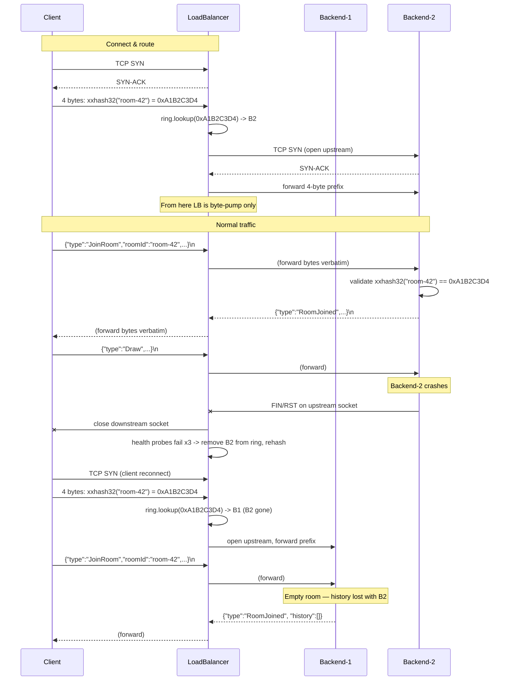

# Load Balancer (L4, consistent hashing on room-id)

## Elevator

Today: one `NetDraw.Server` process owns every room. A client opens a TCP connection
to it, sends a `JoinRoom` JSON frame, and the server keeps the room's `DrawAction`
history in memory until the process dies. Single point of failure, single point of
CPU/memory.

After: N `NetDraw.Server` backends sit behind a small `NetDraw.LoadBalancer`
process. The client TCP-connects to the LB, prepends a 4-byte `xxhash32(roomId)`
prefix to its very first frame, and the LB uses that prefix to pick a backend off
a consistent-hashing ring. Once routed, the LB is a dumb byte pump in both
directions for the lifetime of the connection. Backends never talk to each other.
The LB never parses JSON for routing — only the 4 prefix bytes.

What this buys: rooms are sharded across backends, so the cluster's aggregate
capacity scales with N, and one backend dying only kills the rooms it owned (not
all rooms). What this does not buy: any individual room is no more durable than
before, because room history is still in-memory on a single backend. See "Failure
semantics" below.

## Architecture



Port scheme: the LB listens on `5500` (forward) and `5550` (stats). Backends
use `5000+i` (TCP) and `5050+i` (health) per instance `i`. Three backends on
one host is therefore `5000:5050`, `5001:5051`, `5002:5052` — collision-free
with the LB's own ports and with each other.

The LB has three independent surfaces:

1. **L4 forward listener** (default port `5500`) — accepts client TCP, opens an
   upstream TCP per accepted connection, runs two `Stream.CopyToAsync` pumps.
2. **Health prober** (background loop) — HTTP GET `/health` to each backend
   every 2 s, mutates the ring on threshold crossings.
3. **/stats HTTP listener** (default port `5550`) — read-only JSON dump of ring
   state and counters, modelled on the existing `HttpHealthServer`.

## Routing protocol

A new 4-byte prefix sits OUTSIDE the existing newline-delimited JSON envelope.
It is the first thing the client writes, and the first thing the server (and LB)
reads, on every TCP connection.

```
+--------+--------+--------+--------+--------+--------+--------+---------------
|  H[31:24] H[23:16] H[15:8] H[7:0]  |  '{' '"' 't' 'y' 'p' 'e' '"' ':' ...
+--------+--------+--------+--------+--------+--------+--------+---------------
 \____ xxhash32(roomId), big-endian ____/  \_______ JSON envelope, '\n' delimited ___
```

`H = xxhash32(utf8(roomId), seed=0)` written in **network byte order
(big-endian)**. xxhash32's internal little-endian lane reads are part of the
algorithm spec and are unrelated to the big-endian wire encoding of the
resulting `uint32`.

Hash input is the UTF-8 bytes of the `roomId` string after normalization:

- The client must NFC-normalize `roomId` before both hashing and putting it in
  the JSON envelope. Without this, `phòng-vẽ` typed on Windows (NFC) and on
  macOS (NFD) hashes to two different uint32s and routes to two different
  backends — silent split-brain.
- The server validates that the received `roomId` is already NFC
  (`string.IsNormalized(NormalizationForm.FormC)`); if not, it sends `Error`
  with `"roomId must be Unicode NFC"` and closes.
- No trim, no case-fold beyond NFC.

The server applies the same byte-for-byte hash rule on the post-validation
string, so the two sides never disagree.

### Why xxhash32

- Tiny — fits in ~30 LOC of pure C# with no NuGet additions, satisfies the "no
  new packages" constraint.
- Uniform enough for a routing key (this is not a security context).
- Fast — about a GB/s on modern x86, and we only hash strings ≤ a few hundred
  bytes.
- Well-known wire format with reference vectors, so a client implementation in
  any language can interoperate.

CRC32 was the runner-up. It would also work; xxhash has better distribution on
short strings and is the standard pick for sharding keys.

### Implementation sketch (illustrative)

```csharp
public static class XxHash32
{
    private const uint P1 = 2654435761u;
    private const uint P2 = 2246822519u;
    private const uint P3 = 3266489917u;
    private const uint P4 =  668265263u;
    private const uint P5 =  374761393u;

    public static uint Hash(ReadOnlySpan<byte> data, uint seed = 0)
    {
        int len = data.Length;
        uint h;
        int i = 0;

        if (len >= 16)
        {
            uint v1 = seed + P1 + P2;
            uint v2 = seed + P2;
            uint v3 = seed;
            uint v4 = seed - P1;
            while (i <= len - 16)
            {
                v1 = Round(v1, BinaryPrimitives.ReadUInt32LittleEndian(data.Slice(i,     4)));
                v2 = Round(v2, BinaryPrimitives.ReadUInt32LittleEndian(data.Slice(i + 4, 4)));
                v3 = Round(v3, BinaryPrimitives.ReadUInt32LittleEndian(data.Slice(i + 8, 4)));
                v4 = Round(v4, BinaryPrimitives.ReadUInt32LittleEndian(data.Slice(i + 12,4)));
                i += 16;
            }
            h = RotL(v1, 1) + RotL(v2, 7) + RotL(v3, 12) + RotL(v4, 18);
        }
        else h = seed + P5;

        h += (uint)len;

        while (i <= len - 4)
        {
            h += BinaryPrimitives.ReadUInt32LittleEndian(data.Slice(i, 4)) * P3;
            h  = RotL(h, 17) * P4;
            i += 4;
        }
        while (i < len)
        {
            h += (uint)data[i] * P5;
            h  = RotL(h, 11) * P1;
            i++;
        }

        h ^= h >> 15; h *= P2;
        h ^= h >> 13; h *= P3;
        h ^= h >> 16;
        return h;
    }

    private static uint Round(uint acc, uint lane) { acc += lane * P2; acc = RotL(acc, 13); return acc * P1; }
    private static uint RotL(uint x, int r) => (x << r) | (x >> (32 - r));
}
```

This goes in `NetDraw.Shared/Util/XxHash32.cs` so client, LB, and server share
one implementation. `NetDraw.Shared.Tests` gets one round-trip test against the
known-vector `xxhash32("", seed=0) = 0x02CC5D05`.

### Server-side prefix read

`ClientHandler.ListenAsync` currently goes straight into a UTF-8 decoder loop.
The prefix lives strictly before any text decoding; mixing them is what creates
bugs. So we add a pre-handshake step before the loop:

```csharp
public async Task ListenAsync()
{
    uint expectedPrefix = await ReadPrefixAsync(_stream); // 4 raw bytes, big-endian uint32
    // existing decoder loop unchanged
}
```

`ReadPrefixAsync` reads exactly four bytes with `ReadExactlyAsync` and combines
them as a big-endian `uint32`. No peek, no legacy fallback — the prefix is
mandatory from v1 onward. A connection that closes before four bytes arrive is
torn down; no `Error` frame is sent (we don't yet know the protocol the peer
speaks).

Validation lives in `RoomHandler.HandleJoinAsync`, not in `ClientHandler`. When
the JoinRoom envelope arrives, the handler NFC-normalizes `roomId`, computes
`XxHash32.Hash(Encoding.UTF8.GetBytes(roomId))`, and compares with the stashed
prefix. Mismatch → send `Error` with message
`"roomId hash does not match routing prefix"` and close.

### No legacy peek, no flag day

There is no `0x7B`-peek backwards-compat path. The original sketch proposed one
and ran into two problems the reviewer flagged: the LB would have to do the
same peek (or it can't tell legacy clients apart either), which means the LB is
also fooled at ≈ 0.4% per room and falls back to a default routing rule that
breaks consistent hashing; and shipping the server-side peek before the client
patch creates a flag day where any pre-patch client whose first byte happens to
be whitespace, BOM, or `\n` keepalive gets misread as a v1 prefix.

The simpler rule:

- **LB path:** the LB requires the 4-byte prefix on every accepted connection.
  A connection without one (peer sends `{` first, or fewer than 4 bytes before
  closing) is dropped without an upstream dial. Legacy clients cannot reach the
  cluster through the LB.
- **Direct-to-backend path:** in pre-LB deployments (Phase 1 alone, before the
  LB process exists), clients connect straight to a backend's TCP port. In that
  topology the server still requires the prefix; the v1 client patch lands in
  the same release as the server-side requirement, so there is no asymmetric
  rollout window.
- **Phase 1 ships server and client atomically.** One PR, both projects
  updated, prefix mandatory on both sides from the moment of merge. No feature
  flag, no transition window, no `0x7B` peek anywhere in the system.

## Consistent-hashing ring

Each backend gets `NETDRAW_LB_VNODES` (default 100) entries on the ring, placed
at `xxhash32($"{backendId}#{vnodeIndex}")`. Routing a key = find the smallest
ring entry `>=` the key, wrapping to the first entry if no such entry exists.

`Lookup` runs once per accepted TCP connection (not per draw frame), but it
still needs to be sub-linear and never block on a ring rebuild. A linear
`foreach` over a `SortedDictionary` under a wide lock would make every new
client wait for the prober to finish hashing 100 vnodes whenever a backend
flips state. So the ring keeps two parallel sorted arrays — `uint[] _keys` and
`string[] _ids` — built off the lock and swapped in atomically. Reads do
`Array.BinarySearch` against a snapshot reference; writes compute new arrays
outside the lock and `Volatile.Write` them in.

```csharp
public sealed class HashRing
{
    private readonly object _writeLock = new();
    private readonly int _vnodes;

    private sealed class Snapshot
    {
        public uint[] Keys = Array.Empty<uint>();
        public string[] Ids = Array.Empty<string>();
    }
    private Snapshot _snap = new();

    public HashRing(int vnodes) { _vnodes = vnodes; }

    public string? Lookup(uint key)
    {
        var s = Volatile.Read(ref _snap);
        if (s.Keys.Length == 0) return null;
        int idx = Array.BinarySearch(s.Keys, key);
        if (idx < 0) idx = ~idx;            // first key > target
        if (idx == s.Keys.Length) idx = 0;  // wrap
        return s.Ids[idx];
    }

    public void Add(string backendId)
    {
        var newPairs = ComputeVnodes(backendId); // (uint key, string id) × _vnodes — done OUTSIDE the lock
        lock (_writeLock)
        {
            var cur = _snap;
            var merged = new SortedDictionary<uint, string>();
            for (int i = 0; i < cur.Keys.Length; i++) merged[cur.Keys[i]] = cur.Ids[i];
            foreach (var (k, id) in newPairs)
            {
                if (merged.ContainsKey(k)) continue; // collision: keep incumbent, accept the slight skew
                merged[k] = id;
            }
            Volatile.Write(ref _snap, Materialize(merged));
        }
    }

    public void Remove(string backendId)
    {
        var owned = ComputeVnodes(backendId); // recompute the same hashes outside the lock
        lock (_writeLock)
        {
            var cur = _snap;
            var merged = new SortedDictionary<uint, string>();
            for (int i = 0; i < cur.Keys.Length; i++) merged[cur.Keys[i]] = cur.Ids[i];
            foreach (var (k, _) in owned)
            {
                if (merged.TryGetValue(k, out var owner) && owner == backendId)
                    merged.Remove(k);
                // else: collided with another backend's vnode that won the Add race; leave it
            }
            Volatile.Write(ref _snap, Materialize(merged));
        }
    }

    private List<(uint, string)> ComputeVnodes(string backendId)
    {
        var list = new List<(uint, string)>(_vnodes);
        for (int i = 0; i < _vnodes; i++)
            list.Add((XxHash32.Hash(Encoding.UTF8.GetBytes($"{backendId}#{i}")), backendId));
        return list;
    }

    private static Snapshot Materialize(SortedDictionary<uint, string> sd)
    {
        var s = new Snapshot { Keys = new uint[sd.Count], Ids = new string[sd.Count] };
        int i = 0;
        foreach (var kv in sd) { s.Keys[i] = kv.Key; s.Ids[i] = kv.Value; i++; }
        return s;
    }
}
```

Lookup is `O(log N)` and lock-free. Add/Remove hold `_writeLock` only for the
merge + array materialization; the 100 xxhash32 calls happen outside it. During
a kill-restart demo, new client connections take a binary search over a stale
snapshot until the writer publishes the new one — no client blocks on the
prober.

### Vnode collision policy

Two vnodes from different backends can hash to the same `uint`. With 500 total
vnodes the per-rebuild birthday probability is roughly `500² / (2 · 2³²) ≈
3 × 10⁻⁵`. We accept the resulting slight skew rather than complicate the
data structure with collision lists. Two consequences worth stating:

- **Add** keeps the incumbent on a collision (`if merged.ContainsKey(k)
  continue;`). The newcomer loses one of its 100 vnodes; load impact is
  ≈ 1% of one backend's share, well below the design's 10% expected variance.
- **Remove** checks `owner == backendId` before evicting. Without that check, a
  collided slot owned by a still-live backend would disappear when the
  colliding backend leaves, and the survivor would silently lose part of its
  keyspace.

### Startup seeding

The ring is seeded with every configured backend marked `Healthy` at LB
startup, before the prober has run a single probe. The forwarder is therefore
guaranteed a non-empty ring on its first accepted connection. The prober
demotes any backend that fails its first three probes (≈ 6 s after start),
which mirrors HAProxy's `init-addr last,libc,none` behaviour. Without seeding,
clients connecting in the first 6 s would hit an empty ring and the forwarder
would have to either block, retry, or reject — all worse than serving them
optimistically against a backend that turns out to be dead and letting the
existing reconnect path handle the IOException.

`Lookup` returns `null` only when every configured backend has been removed by
the prober. The forwarder treats `null` as "no upstream available", closes the
client socket immediately, and logs at warn level.

### Why 100 vnodes per backend

Load variance on a consistent-hashing ring drops as `1/√V` where `V` is the
total vnode count. With 100 vnodes per backend and 2–5 backends in the demo,
expected per-backend share variance is around 10%, which is fine for a
classroom workload. Below 50 vnodes the variance becomes visibly lumpy at this
scale; above 200 you're spending memory on a precision the rest of the system
can't observe. 100 is the conventional default in production consistent-hash
implementations.

### Add / remove behaviour

Adding a backend pulls roughly `1/N` of the keyspace off the existing backends
onto the new one. Removing a backend redistributes that backend's keyspace
across all survivors in proportion to their vnode counts. The LB does not
attempt to migrate live connections — see "Failure semantics".

## Health-check

A background `Task` per backend wakes every 2 seconds, issues `GET
http://{backend.host}:{backend.healthPort}/health` with a 1 s timeout, and
records pass/fail.

- 3 consecutive failures while a backend is `Healthy` → set to `Unhealthy` and
  remove from the ring.
- 3 consecutive successes while `Unhealthy` → re-add to the ring.

A 200 response with body `{ "status": "ok", ... }` is required for "pass". Any
non-200, timeout, connection refused, or malformed JSON counts as fail.

### Backend address format

`NETDRAW_BACKENDS` accepts entries of the form `host:tcpPort:healthPort`, comma
separated. The demo topology runs three backends on `127.0.0.1`:

```
NETDRAW_BACKENDS=127.0.0.1:5000:5050,127.0.0.1:5001:5051,127.0.0.1:5002:5052
```

The third field is required because the existing server's `HEALTH_PORT` defaults
to `5050` and is per-process — running 3 backends on one host means each needs
its own pair: `5000/5050`, `5001/5051`, `5002/5052`, leaving the LB's own
`5500/5550` clear. Making the LB infer the health port from the TCP port would
hide this from the operator.

If `:healthPort` is omitted, the LB falls back to `5050` and logs a warning.

### Race conditions

There are two real ones:

**Probe in flight while backend dies.** A probe started at T0 may not return
until T+1s. If the backend crashes at T+0.1s, the probe will fail. This is
correct behaviour — the failure counter increments, and after three such
failures the backend leaves the ring. The window (3 × 2s = 6s) is the
detection latency. A faster probe interval reduces it at the cost of more LB
load on healthy backends.

**Backend dies between two probes.** Existing forwarded connections to that
backend will fail their `Stream.CopyToAsync` pumps with `IOException`, the LB
tears them down, and the client reconnects. This may happen up to 6 s before
the LB removes the backend from the ring, which means the client's reconnect
attempt during that window may land on the same dead backend, fail, and need
another retry. The reconnect protocol (P8.T1, designed elsewhere) already has
to handle this — health-check is not the only thing that can knock a
connection down, so the client must retry regardless.

**Flapping.** A backend that oscillates pass/fail/pass/fail will not change
ring state because the threshold is `3 consecutive`. A backend that crosses
the threshold both ways repeatedly will cause repeated rehashes. The
mitigation is the threshold itself; if it proves too aggressive in the demo we
add a cooldown of one probe interval after each state change.

## Failure semantics

This is the subsection people will not read carefully and then be surprised by,
so it is blunt.

`Room._history` lives in process memory inside one `NetDraw.Server`. When that
backend dies, every room it was hosting loses its `DrawAction` history. The LB
notices, removes the backend from the ring, and the next time a client tries
to join one of those rooms it gets routed to a survivor. The survivor has
never heard of the room, so it creates a fresh empty `Room` and the
`RoomJoined` message carries an empty `history` array. The user sees a blank
canvas where their drawing used to be.

What the LB recovers:

- The cluster keeps accepting connections — other backends keep serving their
  rooms, clients in those rooms see no disruption.
- A reconnecting client gets routed to a live backend instead of hammering the
  dead one.

What the LB does not recover:

- Any room that was on the dead backend. The drawing is gone.
- Any in-flight `DrawAction` that hadn't been broadcast yet.
- Per-user identity continuity within a room — when the client reconnects it
  gets a fresh `JoinRoom`/`RoomJoined` cycle. (The session-token reconnect
  flow under P8.T1 is what eventually papers this over from the user's
  perspective; the LB does not.)

The honest framing: this design improves **aggregate cluster availability**
(no single backend kills the whole service). It does not improve
**per-room availability** at all compared to a single-server deployment. A
room hosted on backend B is exactly as available as B itself.

The alternative is persistent room storage with cross-backend replication,
which is a different project and explicitly out of scope here.

## /stats endpoint

The LB exposes `GET http://{lb-host}:{NETDRAW_LB_STATS_PORT}/stats` (default
`5550`) returning a JSON snapshot. Same `HttpListener` pattern as
`HttpHealthServer.cs`, separate port from the L4 forwarder.

```json
{
  "lb": {
    "uptime_seconds": 1820,
    "vnodes_per_backend": 100,
    "last_rehash_at": "2026-05-03T11:42:08Z",
    "last_rehash_reason": "backend 127.0.0.1:5002 unhealthy"
  },
  "backends": [
    {
      "id": "127.0.0.1:5000",
      "health_url": "http://127.0.0.1:5050/health",
      "state": "healthy",
      "consecutive_failures": 0,
      "consecutive_successes": 412,
      "last_probe_at": "2026-05-03T11:43:18Z",
      "active_connections": 27,
      "bytes_in_per_sec": 14820,
      "bytes_out_per_sec": 38110
    },
    {
      "id": "127.0.0.1:5001",
      "state": "healthy",
      "active_connections": 31,
      "bytes_in_per_sec": 16002,
      "bytes_out_per_sec": 40220
    },
    {
      "id": "127.0.0.1:5002",
      "state": "unhealthy",
      "consecutive_failures": 7,
      "active_connections": 0
    }
  ],
  "ring_sample": [
    { "key": "0x0001a2b3", "backend": "127.0.0.1:5000" },
    { "key": "0x00045def", "backend": "127.0.0.1:5001" }
  ]
}
```

`bytes_in_per_sec` and `bytes_out_per_sec` are EWMA over the last 10 s,
computed in the pump. `ring_sample` shows up to 16 evenly-spaced ring entries
(not all 300+) so the demo can eyeball the distribution without the response
being unreadable. `msg/s` is approximated as `bytes_in_per_sec / 200` (rough
average JSON frame size) and labelled as such if surfaced in the demo UI.

The demo script does:

1. Start 3 backends on `127.0.0.1:5000`, `:5001`, `:5002` (health on `:5050`,
   `:5051`, `:5052`).
2. Start LB on `127.0.0.1:5500` (forward) and `:5550` (stats).
3. Open 6 clients pointing at `127.0.0.1:5500`, observe `/stats` shows roughly
   `2 + 2 + 2` connections across the three backends.
4. `kill -9` the backend on `:5002`, watch `/stats` — within ~6 s `state`
   flips to `unhealthy`, `active_connections` reflects clients that lost
   their sockets, `last_rehash_at` updates, surviving backends pick up the
   reconnects.
5. Restart the `:5002` backend, watch it return to `healthy` after ~6 s and
   start accepting new traffic again. Existing connections do not migrate
   back.

## Project layout

New top-level project `NetDraw.LoadBalancer/`:

```
NetDraw.LoadBalancer/
  NetDraw.LoadBalancer.csproj      net8.0, ProjectReference -> NetDraw.Shared
  Program.cs                       env-var config, wires everything together
  Config/
    LbConfig.cs                    NETDRAW_BACKENDS / NETDRAW_LB_PORT / NETDRAW_LB_VNODES /
                                   NETDRAW_LB_STATS_PORT parsing, env-var pattern from
                                   Server/Program.cs (ReadIntEnv / log-and-default-on-bad)
  Routing/
    HashRing.cs                    parallel uint[] keys + string[] ids snapshot,
                                   binary-search lookup, copy-on-write add/remove (sketch above)
    BackendRegistry.cs             id -> {tcpEndpoint, healthEndpoint, state}; thread-safe
  Forwarding/
    ConnectionForwarder.cs         accept loop; per-conn: read prefix, lookup, dial backend,
                                   forward prefix, run two CopyToAsync pumps, tear down
    PrefixReader.cs                4-byte big-endian uint32 reader; mandatory,
                                   no legacy fallback (peer disconnect on short read)
  Health/
    HealthProber.cs                per-backend loop: probe, threshold, mutate registry+ring
  Stats/
    StatsHttpServer.cs             modelled on Services/HttpHealthServer.cs
    Counters.cs                    EWMA over byte counts, atomic increments from the pumps
```

`NetDraw.slnx` gets one new line:

```xml
<Project Path="NetDraw.LoadBalancer/NetDraw.LoadBalancer.csproj" />
```

`NetDraw.Shared/Util/XxHash32.cs` is new and shared by Shared.Tests, Server,
LoadBalancer, and Client.

No NuGet additions. The `HttpListener`, `TcpListener`, `TcpClient`,
`Stream.CopyToAsync`, `SortedDictionary`, `BinaryPrimitives`,
`Microsoft.Extensions.Logging` machinery used elsewhere covers everything.

## Phases

**Phase 1 (S) — protocol prefix, server + client atomic.** One PR. Add
`NetDraw.Shared/Util/XxHash32.cs` with one known-vector test in
`NetDraw.Shared.Tests`. Patch `ClientHandler` with the pre-handshake prefix
read (mandatory `ReadExactlyAsync` of 4 bytes — no `0x7B` peek, no legacy
fallback, peer disconnect on short read). Patch `RoomHandler.HandleJoinAsync`
to NFC-validate `roomId`, hash it, and compare against the stashed prefix;
emit `Error` on mismatch. Update the existing client to NFC-normalize and
send the prefix. Server and client land in the same release so there is no
window where one side requires the prefix and the other doesn't. Backends
still run standalone; nothing in this phase requires the LB to exist.

**Phase 2 (M) — LB process with ring + bidirectional pump.** Scaffold
`NetDraw.LoadBalancer`. Implement `HashRing`, `BackendRegistry`,
`ConnectionForwarder` with the prefix-read-and-route flow and two
`Stream.CopyToAsync` pumps wrapped in `try/catch IOException`. Static
`NETDRAW_BACKENDS` config — no health-checking yet, all backends are
permanently in the ring. Manual integration test: 2 backends, 4 clients,
`kill` a backend and observe the LB does not yet rehash (Phase 3 handles
that).

**Phase 3 (S) — health-check + rehash.** Implement `HealthProber`. Wire it to
mutate `BackendRegistry` and `HashRing` on the 3-consecutive-failures /
3-consecutive-successes thresholds. Update demo: `kill -9` a backend, watch
within 6 s for the rehash. Connections to the dead backend tear down via
`IOException` in the pump; clients reconnect and land on a survivor.

**Phase 4 (S) — /stats + demo script.** Implement `StatsHttpServer` and
`Counters`. EWMA byte counters increment from inside the pump. Write the
demo script (shell, kicks off backends + LB + 6 clients, drives the kill /
restart sequence, `curl`s `/stats` between steps).

Effort: ~3 weeks for one junior C# dev who hasn't shipped a TCP proxy
before, assuming the P8.T1 reconnect logic lands first. The S/M/S/S labels
are size-relative; the absolute time goes into `Stream.CopyToAsync` half-close
correctness, the `IOException` taxonomy in the pump, a kill-9 test harness
that doesn't lie, and getting the EWMA counters off the hot path. An
experienced dev would land this in ~1.5 weeks; the demo grader is not the
bottleneck, the proxy correctness is.

## Open questions

1. **Connection draining on health-flap.** When a backend transitions to
   `Unhealthy` but its TCP socket is still open (e.g. the backend is hung,
   not crashed), should the LB proactively close all forwarded connections
   to it to force the clients to reconnect onto the new ring? Or leave
   existing connections in place until they fail naturally? Closing
   converges faster but creates noise during a flap.
2. **`NETDRAW_BACKENDS` add/remove at runtime.** Re-reading the env var on
   `SIGHUP` is one option; an admin endpoint on `/stats` (POST add/remove)
   is another. The brief is silent. v1 can ship with a process restart
   being the only way to change the backend set.
3. **roomId case-folding.** NFC normalization (decided above) handles
   Unicode-equivalent forms but does not fold case: `"Room-42"` and
   `"room-42"` still hash to different backends. Open whether v1 also
   lowercases before hashing (friendlier to typos, mild surprise risk for
   users who care about display casing) or leaves the `roomId` exactly as
   the user typed it. Default: leave it; revisit if the demo trips on it.

## Out of scope

- Persistent room storage (any kind of disk-backed `Room._history`).
- Cross-backend replication of rooms.
- LB-side TLS termination.
- mTLS or any auth between LB and backends.
- Anything that requires backends to share state — registries, sessions,
  presence, locks.
- Connection migration on rehash (the LB cannot move a TCP connection, full
  stop).
- L7 features: routing on JSON content, request-level retries, response
  rewriting. The whole point of Path A is that the LB does not parse JSON.
