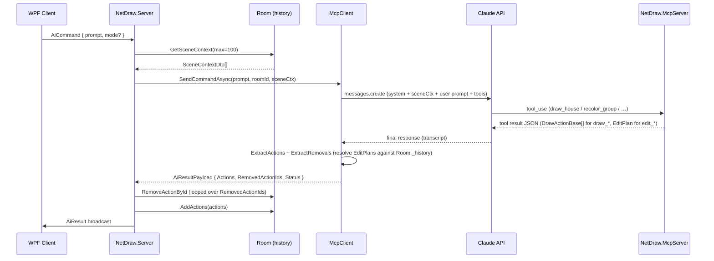

# NetDraw MCP v2 — AI Layer Design

## Elevator

The v2 MCP layer solves four specific problems with the current one-shot, coordinate-blind AI: it gives Claude a per-group text summary of what's already on the canvas before each request (so "add a window to the house" can target the right location and group), it introduces a translate-only `frame` parameter on composites so Claude can draw in a bounded sub-region rather than guessing absolute pixel positions across a 3000×2000 canvas, it adds four edit tools (`recolor_group`, `move_group`, `delete_group`, `replace_group`) that take a group id and let the DrawServer resolve and mutate the room's history — emitting an additive `RemovedActionIds` field in `AiResultPayload` plus a `Status` enum so clients drop stale strokes without a full canvas reset and don't mistake delete-only edits for failures — and it extends five major composites with a `style` parameter backed by JSON files so the library can grow without recompiling.

## Architecture diagram



## Concrete changes per concern

### 1. Zoom / controllable subspace

The problem: every composite takes absolute canvas coordinates. Claude must guess `(cx, cy, size)` for a 3000×2000 surface it cannot see. Result: small subjects too small, large ones bleed off the edge, related subjects placed near each other unreliably.

The fix: a `frame` argument on every composite, and a `draw_in_frame` wrapper tool that **translates** a batch of actions so their coordinates are relative to the frame's top-left. **No scaling.** Composites are responsible for producing output of the right size for their frame; the wrapper just shifts.

This is the same operation `DrawTransformed` (`DrawingTools.Library.cs:760`) already performs when called with `scale: 1.0`, `rotateDeg: 0`. v2 adds a named `frame` wrapper so Claude doesn't have to think in pivot/dx/dy terms, and adds a per-composite convention so the composites know how to fill a frame.

Why translate-only and not scale-to-fit:

- Scaling the actions inside a frame would have to scale strokes anisotropically (`scaleX = w / w_native`, `scaleY = h / h_native`) when the frame's aspect ratio differs from the composite's. `DrawTransformed` only takes a single `scale` and would distort. Adding anisotropic scale touches `DrawTransformed` itself.
- Translate-only is additive. It composes cleanly with the existing transform machinery and does not need any change to `DrawTransformed`.
- Composites already know their natural size — they take `width`/`height` (e.g. `DrawHouse(baseX, baseY, width, height)`). Telling them their natural size *is* the frame size is straightforward.

The cost: composites must now honour a "fill the frame" convention when `cx`/`cy`/`size` (or `width`/`height`) are omitted. That makes those parameters effectively optional — see the next item.

```csharp
[McpServerTool, Description(
    "Draw a batch of inner tool calls INSIDE a rectangular frame on the canvas. " +
    "frame=[x,y,w,h] in canvas pixels. Coordinates inside actionsJson are treated as " +
    "frame-local: (0,0) is the frame's top-left. Inner actions must produce output " +
    "sized to the frame; this wrapper translates only, it does not scale.")]
public static string DrawInFrame(
    [Description("JSON array — same format as DrawMany")] string actionsJson,
    [Description("Frame [x, y, width, height] in canvas pixels")] double[] frame)
{
    if (frame.Length != 4) throw new ArgumentException("frame must be [x, y, w, h]");
    double fx = frame[0], fy = frame[1];
    return DrawTransformed(actionsJson, pivotX: fx, pivotY: fy, dx: fx, dy: fy, scale: 1.0);
}
```

**Composite signature change — cx/cy/size become optional and default to the frame.** v1 said "composites default to filling their frame if cx/cy/size are omitted" but the proposed code only added the `frame` parameter — the existing positional params were still required. That doesn't compile and the system prompt's claim was a lie. Fix: the relevant params become nullable, and when both `frame` is set and the params are null, the composite computes them from the frame:

```csharp
public static string DrawHouse(
    double[]? frame = null,
    double? baseX = null, double? baseY = null,
    double? width = null, double? height = null,
    string style = "default", string? bodyColor = null, string? roofColor = null,
    string? groupId = null)
{
    // Resolve effective box: explicit args win; otherwise fill the frame.
    (double bx, double by, double w, double h) = ResolveBox(frame, baseX, baseY, width, height);
    // ... existing draw logic ...
}

// Helper: explicit args win; if any are null and frame is set, fill from frame.
// If both are null, throw — caller must provide at least one.
private static (double x, double y, double w, double h) ResolveBox(
    double[]? frame, double? x, double? y, double? w, double? h) { ... }
```

Same shape for `DrawCatFace`, `DrawMangaFace`, `DrawTree`, `DrawCar`, and the icon stickers — `cx`/`cy`/`size` (or whatever each one calls them) become nullable with frame-derived defaults. Composites that don't take a frame (legacy callers) keep working because the params were already required and explicit.

Files touched:
- `NetDraw.McpServer/DrawingTools.cs` — add optional `double[]? frame` and make positional shape params nullable on `DrawCatFace`, `DrawMangaFace`, `DrawHouse`, `DrawTree`, `DrawCar`, and the other major composites. Default `null` (full-canvas behaviour unchanged when both frame and explicit params are null is *not* supported — the helper throws; callers must supply one or the other).
- `NetDraw.McpServer/DrawingTools.Library.cs` — same for `DrawMountain`, `DrawCloud`, `DrawMoon`, the icon stickers.
- `NetDraw.Server/Services/McpClient.cs` — update the system prompt to explain the frame convention with examples.

System prompt addition:

```
FRAMES: if you know where on the canvas a subject should land, use draw_in_frame(actionsJson, frame=[x,y,w,h]).
Inside actionsJson, treat the frame's top-left as (0,0) and bottom-right as (fw, fh).
draw_in_frame translates only; composites must produce output sized to the frame.
Composites with frame support: omit cx/cy/size (and baseX/baseY/width/height for rectangular ones)
to fill the frame; supply them only when you want a smaller subject within the frame.
```

No wire format changes. No client changes. No new `DrawActionBase` subtype.

Canvas as per-room property: `canvasWidth: 3000, canvasHeight: 2000` appears in `Program.cs:23` and an unrelated default of `1000×700` lives in `McpClient.cs:54`. The dead default has confused readers twice. Fix: add `CanvasWidth` / `CanvasHeight` to `Room`, read them in `McpClient.SendCommandAsync` from the room, delete the `McpClient` ctor defaults.

`JoinRoom` has no payload today — the handler reads `senderId`, `senderName`, `roomId` from the envelope. Phase 2 introduces a new payload type so the client can declare its canvas size:

```csharp
// NetDraw.Shared/Protocol/Payloads/JoinRoomPayload.cs (new)
public class JoinRoomPayload : IPayload
{
    [JsonProperty("canvasWidth")]  public int? CanvasWidth  { get; set; }
    [JsonProperty("canvasHeight")] public int? CanvasHeight { get; set; }
}
```

Both fields nullable so old clients (no body) continue to work — server falls back to its configured default. `RoomHandler.HandleJoinAsync` deserializes the body and stores the dimensions on the `Room` if it's the first joiner; subsequent joiners do not get to overwrite. (Re-using `UserPayload` was tempting but it's the body for `UserJoined` / `UserLeft` and overloading it mixes concerns.)

### 2. Vision — Claude seeing the canvas

The problem: Claude has no knowledge of what's drawn. "Add a window to the house" re-draws the house from scratch in the wrong place.

The fix: scene context as a compact JSON description. Before calling Claude, `McpClient.SendCommandAsync` calls `room.GetSceneContext(max: 100)` and injects a structured summary into the system message. A pixel-accurate image isn't needed for the majority of edit requests; a text summary with bounding boxes and group IDs solves complaints #2 and #3.

**Per-group rows, not per-action.** A composite like `DrawHouse` produces 5–10 actions sharing one `GroupId`. Emitting each action as its own row would (a) blow the token budget on busy canvases and (b) give Claude a per-stroke view it doesn't want — "the house" is one logical object, not eight pen strokes. So `GetSceneContext` aggregates by `GroupId`: each group becomes one row whose bbox is the union of its members' bboxes; standalone actions (no `GroupId`, e.g. user-drawn pen strokes) get one row each.

New server-side type:

```csharp
// NetDraw.Server/Models/SceneContextDto.cs
public record SceneContextDto(
    string Id,             // GroupId for grouped, action Id for standalone
    string Kind,           // composite | pen | shape | line | text | erase | image
    string? GroupId,       // null for standalone actions
    int    ActionCount,    // 1 for standalone, N for groups
    string Color,          // primary stroke color (most-frequent if mixed)
    string? FillColor,
    double X, double Y, double W, double H,  // union bbox
    string? Label          // for text actions / groups containing text: first text content
);
```

`Kind` carries `composite` for any group of more than one action; otherwise it carries the underlying action's type. Claude doesn't need to know that "the cat face" is internally pens-and-circles; it needs to know it's one logical thing with a bbox and a group id to address.

Bbox derivation per action type:

- `PenAction` — min/max of `Points`.
- `ShapeAction` — `X, Y, Width, Height` directly.
- `LineAction` — min/max of `(StartX, StartY)` and `(EndX, EndY)`.
- `TextAction` — `(X, Y)` to `(X + estimatedTextWidth, Y + FontSize)`. Cheap estimate: `FontSize * 0.6 * Text.Length`. Imperfect, but Claude is using this to point at things, not to lay out type.
- `EraseAction` — min/max of `Points`. Treated as a normal entry; Claude can see the user erased somewhere even if no stroke is there now.
- `ImageAction` — `(X, Y, Width, Height)` directly.

`ClearCanvas` is a `MessageType`, not a `DrawActionBase` — it never lands in `_history`, it just resets it. Nothing to surface.

Group-color rule: take the most frequent color among the group's strokes. Ties broken by the first-added action's color. Cheap, correct most of the time, and noticeably better than "first action wins" for composites where the dominant body color is only on a couple of strokes.

```csharp
// NetDraw.Server/Room.cs (addition)
public List<SceneContextDto> GetSceneContext(int max = 100)
{
    lock (_lock)
    {
        var recent = _history.Count > max
            ? _history.Skip(_history.Count - max).ToList()
            : _history;

        var rows = new List<SceneContextDto>();
        // Standalone (no GroupId) — one row each, in arrival order.
        // Grouped — one row per GroupId, bbox = union, color = mode.
        // Implementation walks `recent` once, accumulating per-group state in a dict
        // keyed by GroupId, and emitting standalone rows inline.
        // ...
        return rows;
    }
}
```

**Stale-bbox caveat (Phase 1 limitation).** `MoveObject` is broadcast-only — `ObjectHandler` re-emits the message but never mutates `_history`. So once a user drags an action, its scene-context bbox lags the visible position. Phase 1 ships with this limitation documented; Phase 2 needs a Room-side fix (see open question 6).

`McpClient` changes — `SendCommandAsync` now receives an optional `IReadOnlyList<SceneContextDto>? scene` and builds a scene block:

```csharp
string sceneBlock = scene is { Count: > 0 }
    ? "\n\n--- CANVAS CONTENTS (last " + scene.Count + " actions) ---\n"
      + JsonConvert.SerializeObject(scene, Formatting.None)
      + "\n--- END CANVAS CONTENTS ---"
    : "\n\nCanvas is empty.";
// Appended to the system message before the user prompt.
```

`AiHandler` reads the scene before forwarding:

```csharp
var scene = _roomService.GetRoom(roomId)?.GetSceneContext(max: 100);
var mcpResult = await _mcpClient.SendCommandAsync(prompt, roomId, scene);
```

System prompt addition (end of scene block):

```
When the user asks to add, modify, or reference something already on the canvas,
use the CANVAS CONTENTS above to determine GroupId and bounding box.
EDITING RULE: to change an existing element, call the matching edit tool
(recolor_group, move_group, delete_group, replace_group) with its GroupId.
Do NOT re-draw it from scratch.
```

Token budget: with per-group aggregation, 100 rows × ~120 bytes of JSON ≈ 12K characters ≈ 3K tokens. Combined with the existing 16K `MaxTokens` output cap and a complex system prompt, comfortably within the model's context window (claude-sonnet-4-5 handles 200K input tokens). Worst case is a canvas of ~500 manual pen strokes (no grouping) — at that point the scene context would be ~500 standalone rows. Trim by recency or move to viewport filtering (open question 2).

Real pixel vision is parked as Phase 5 — `DataContent(ReadOnlyMemory<byte>, "image/png")` is available in `Microsoft.Extensions.AI` 10.3.0, but the blocker is the server-side rasterizer. The client uses WPF; the server would need SkiaSharp to reproduce the same rendering. That's a week of fiddly pixel work (scanline fills, calligraphy pen styles, Catmull-Rom sampling) to look right. Scene-context text solves 80% of the vision complaints in a day.

### 3. Iterative edit

The problem: every AI prompt replaces the entire canvas or adds to it blindly. There's no way to say "change the roof colour" or "delete the third tree" without redrawing everything.

The fix: four new MCP tools + `RemovedActionIds` in the payload.

`AiResultPayload` gets one new nullable field:

```csharp
// NetDraw.Shared/Protocol/Payloads/AiResultPayload.cs (additive)
[JsonProperty("removedActionIds", NullValueHandling = NullValueHandling.Ignore)]
public List<string>? RemovedActionIds { get; set; }
```

This is additive at the wire level: old clients ignore unknown fields (Newtonsoft default), and the fallback parser never sets it. But it is *not* zero behavioural impact. An old client in a mixed-version room will keep rendering the strokes a new client just deleted — the rooms diverge as soon as the first edit lands. So Phase 3 needs a client-version gate before rollout: if the room has any client below the version that honours `RemovedActionIds`, the server should refuse edit-intent prompts (or downgrade them with an error to the prompter). The `feat/protocol-version` branch already adds a `Version` field to `MessageEnvelope` / `NetMessage` and a server-side mismatch-close path — Phase 3 should land on top of that branch (or its merged form) and bump the version, then refuse edit-intent commands when any client in the room reports a lower version.

Server applies removals before broadcasting:

```csharp
// AiHandler.cs — in ProcessInBackgroundAsync, after getting mcpResult
if (result.RemovedActionIds is { Count: > 0 })
    foreach (var id in result.RemovedActionIds)
        _roomService.GetRoom(roomId)?.RemoveActionById(id);
// RemoveActionById already exists in Room.cs:94
```

Client deletes removed IDs from its local draw list on receiving `AiResult` with `removedActionIds` populated.

**Tool surface — McpServer side.** Three tools that take only IDs and parameters; the *server* (not Claude) resolves the group from `Room._history`. Earlier drafts had Claude pass a `currentActionsJson` blob alongside the `groupId`, but the scene context Claude sees only carries `SceneContextDto` summaries (bbox + metadata), not the full `DrawActionBase` JSON for the strokes inside a group. Sending all per-action JSON in the prompt would re-inflate the token budget that scene aggregation just deflated. So the deterministic move is: tool takes `groupId`, server looks up the actions:

```csharp
[McpServerTool, Description(
    "Recolor every stroke in a group. Pass groupId from CANVAS CONTENTS. " +
    "newFillColor is optional; null keeps the existing fill.")]
public static string RecolorGroup(string groupId, string newColor, string? newFillColor = null)
{
    // Returns an EditPlan DTO. Server resolves groupId -> actions and applies.
    return JsonConvert.SerializeObject(new EditPlan {
        Op = "recolor", GroupId = groupId,
        Color = newColor, FillColor = newFillColor
    });
}

[McpServerTool, Description("Move a group by (dx, dy) pixels. Pass groupId from CANVAS CONTENTS.")]
public static string MoveGroup(string groupId, double dx, double dy) => /* EditPlan { Op="move", … } */;

[McpServerTool, Description("Delete every stroke in a group. Pass groupId from CANVAS CONTENTS.")]
public static string DeleteGroup(string groupId) => /* EditPlan { Op="delete", GroupId=… } */;

// Plain DTO returned by the tools; server interprets it.
record EditPlan(string Op, string GroupId, string? Color = null, string? FillColor = null,
                double Dx = 0, double Dy = 0);
```

The McpServer doesn't have the room state, so its job is to emit a structured *intent* (the `EditPlan`). The DrawServer's `McpClient` parses the tool call, looks the group up in `Room._history`, performs the mutation (clone strokes with new color / new coordinates / new IDs, or just collect IDs to remove), and produces the `(NewActions, RemovedActionIds)` pair that becomes the `AiResultPayload`. This keeps the McpServer pure (no room state) and the DrawServer authoritative.

**`ReplaceGroup` — explicit, not prompt-driven.** v1 said `ReplaceGroup` "calls the appropriate composite internally" based on the user prompt. But `NetDraw.McpServer` is a deterministic tool host with no LLM access — it can't decide "this prompt means draw a victorian house". Two ways to fix this; v2 picks the explicit one:

```csharp
[McpServerTool, Description(
    "Delete a group and emit a new composite in its place. " +
    "compositeName is one of the draw_* tool names; compositeArgs is JSON matching that tool's signature. " +
    "Use this when a user wants to swap one subject for another (e.g. 'turn the cat into a dog').")]
public static string ReplaceGroup(string groupId, string compositeName, string compositeArgs)
{
    return JsonConvert.SerializeObject(new EditPlan {
        Op = "replace", GroupId = groupId,
        ReplaceWithTool = compositeName, ReplaceWithArgs = compositeArgs
    });
}
```

Claude, having an LLM, picks the composite name and arg shape. The server deletes the old group then invokes the named composite via reflection (or a small dispatch map) and concatenates the result. The alternative — implementing `ReplaceGroup` in the DrawServer's `AiHandler` with a second LLM hop — was rejected for v2: it doubles the API cost per replace and adds an asynchronous step inside what users perceive as a single command. Revisit if the explicit form proves clumsy in practice.

**Edit-intent detection — soft hint, not a hard tool restriction.** Keyword router in `McpClient.RouteByKeyword` currently restricts Claude to one tool when a subject keyword matches. Edit prompts like "đổi mái nhà sang xanh" ("change the house roof to blue") contain "nhà" and would be incorrectly routed to `draw_house` only. Fix: edit-intent check before `RouteByKeyword`:

```csharp
private static readonly string[] EditKeywords =
    { "change", "recolor", "move", "delete", "remove", "replace", "edit",
      "đổi", "di chuyển", "xóa", "thay", "sửa" };

private static bool IsEditIntent(string command)
{
    string lc = command.ToLowerInvariant();
    return EditKeywords.Any(k => lc.Contains(k));
}

// In SendCommandAsync, before RouteByKeyword:
if (IsEditIntent(command))
    return (_tools, "\n\n━━━ EDIT MODE ━━━\nUse recolor_group/move_group/delete_group/replace_group. " +
                    "Do not draw new primitives unless the user explicitly asks for them.");
```

The `_tools` list is *not* filtered to edit-only when the hint fires — Claude still has the full toolset and can ignore the hint and call `draw_house`. This is intentional for v2: the keyword list is incomplete (especially across Vietnamese phrasings) and a hard filter that misclassifies a prompt strands the user with no usable tool. Living with occasional drift is the cheaper failure mode. Revisit if logs show Claude routinely bypassing the hint.

**Fallback parser** — `FallbackAiParser` doesn't understand edit operations and never will without Claude. It stays create-only. If MCP is offline and the user issues an edit command, `AiHandler` should return an error payload rather than run the fallback, to avoid producing garbage.

**Scope — AI-content edits only.** Pen/line/shape/text actions drawn by users (not AI) don't carry a `GroupId`. So `recolor_group` and friends only act on groups present in the scene context, which today means AI-emitted content. Manually-drawn user strokes are addressable individually (each has its own `Id` and shows as a standalone scene-context row), but the v2 edit tools take group ids, so they don't operate on manual content. Tool names stay `recolor_group` etc. — adding `_ai_` to the name is uglier and adds noise to the system prompt. The precondition is documented in the system prompt instead: "edit tools target groups; user-drawn strokes have no group". Auto-grouping manual drawings on submit is a client-side change with its own design questions and is moved to out-of-scope.

**Client-side success signal — Status field on `AiResultPayload`.** The client today treats `aiResult.Actions.Count == 0` as failure (`MainViewModel.cs:224` writes "Không sinh được hình vẽ"). A successful delete-only edit returns zero new actions and one or more removals; the current UI would call that a failure. Adding a status enum is cleaner than overloading the empty-actions check:

```csharp
public enum AiResultStatus { Ok, Empty, Error }

// AiResultPayload (additive)
[JsonProperty("status", NullValueHandling = NullValueHandling.Ignore)]
public AiResultStatus? Status { get; set; }
```

Server sets `Status = Ok` whenever `Actions.Count > 0` *or* `RemovedActionIds.Count > 0`, `Status = Empty` when both are zero with no error, `Status = Error` when `Error` is set. Client code path: switch on `Status` if present (new server), else fall back to current behaviour (old server). The chat-line wording becomes "Đã xóa N đối tượng" / "Đã sửa N đối tượng" / etc. depending on the mix.

### 4. Style library

The problem: `draw_house` produces one canonical house. Users want Victorian, modern, cartoon, etc.

The fix: a `style` parameter on composites, backed by JSON files. Add `style` to `DrawHouse`, `DrawTree`, `DrawMangaFace`, `DrawCatFace`, and `DrawCar`. Default `"default"` (existing behaviour, backward-compatible).

Style data lives in `NetDraw.McpServer/Styles/`:

```
NetDraw.McpServer/Styles/
  house.json
  tree.json
  manga_face.json
  cat_face.json
  car.json
```

Each file is a dictionary of style name → parameter overrides:

```json
// house.json
{
  "default": {},
  "modern":  { "roofSlant": 0.05, "hasChimney": false, "windowStyle": "rectangular", "bodyColor": "#F5F5F5" },
  "victorian": { "roofSlant": 0.55, "hasChimney": true, "chimneyCount": 2, "bodyColor": "#B8860B", "trim": "#FFFFFF" },
  "vietnamese": { "roofSlant": 0.35, "roofCurve": true, "bodyColor": "#E8D5A3", "hasBalcony": true },
  "cartoon":  { "roofSlant": 0.45, "strokeWidth": 4, "bodyColor": "#FF6B6B", "outlined": true }
}
```

The composite reads the JSON at startup (loaded once into a static dict) and merges the style overrides with its own defaults:

```csharp
private static readonly Dictionary<string, Dictionary<string, object>> HouseStyles =
    LoadStyles("Styles/house.json");

[McpServerTool, Description("COMPOSITE — draws a house. style: default|modern|victorian|vietnamese|cartoon")]
public static string DrawHouse(
    double[]? frame = null,
    double? baseX = null, double? baseY = null,
    double? width = null, double? height = null,
    string style = "default",
    string? bodyColor = null,
    string? roofColor = null,
    string? groupId = null)
{
    (double bx, double by, double w, double h) = ResolveBox(frame, baseX, baseY, width, height);
    var s = MergeStyle(HouseStyles, style, new {
        bodyColor = bodyColor ?? "#E8D5A3",
        roofColor = roofColor ?? "#8B4513",
        roofSlant = 0.40,
        hasChimney = true,
        // ...
    });
    // draw using bx, by, w, h and s.bodyColor, s.roofSlant, etc.
}
```

Adding a new style = edit the JSON file, restart the McpServer process. No C# changes needed.

System prompt update — add to the RULE #0 composite table:

```
Composites with style support:
  draw_house     style: default|modern|victorian|vietnamese|cartoon
  draw_tree      style: default|pine|palm|cherry|autumn
  draw_manga_face style: default|chibi|realistic|gothic
  draw_cat_face  style: default|cartoon|realistic|grumpy
  draw_car       style: default|sports|truck|vintage
```

Files created:
- `NetDraw.McpServer/Styles/house.json`
- `NetDraw.McpServer/Styles/tree.json`
- `NetDraw.McpServer/Styles/manga_face.json`
- `NetDraw.McpServer/Styles/cat_face.json`
- `NetDraw.McpServer/Styles/car.json`
- `NetDraw.McpServer/StyleLoader.cs` — static helper: `LoadStyles(path)`, `MergeStyle(dict, name, defaults)`

Files touched:
- `NetDraw.McpServer/DrawingTools.Library.cs` — add `style` param and `MergeStyle` call in the 5 composites.

## Phases

### Phase 1 — Scene Context (S, ≤2 days)

Deliverable: Claude receives a JSON summary of the last 100 canvas actions before each prompt.

New files:
- `NetDraw.Server/Models/SceneContextDto.cs`

Files touched:
- `NetDraw.Server/Room.cs` — add `GetSceneContext(int max)`
- `NetDraw.Server/Services/McpClient.cs` — pass scene to `SendCommandAsync`, inject as system block
- `NetDraw.Server/Handlers/AiHandler.cs` — read scene, pass to McpClient
- `NetDraw.Shared/Protocol/Payloads/AiCommandPayload.cs` — no change needed (scene ctx is server-side only)

Demo: prompt "add a tree next to the house" — Claude reads the scene context, finds the house's bbox, places the tree adjacent rather than centred on the canvas.

### Phase 2 — Frames and per-room canvas (M, ≤1 week)

Deliverable: composites accept a `frame` param; canvas size is a per-room property instead of a hardcoded constant.

New files:
- `NetDraw.McpServer/DrawInFrame.cs` (or addition to `DrawingTools.Library.cs`)
- `NetDraw.Shared/Protocol/Payloads/JoinRoomPayload.cs` — new payload type carrying `CanvasWidth?`/`CanvasHeight?`

Files touched:
- `NetDraw.McpServer/DrawingTools.cs` and `DrawingTools.Library.cs` — add optional `double[]? frame` to major composites and make `cx`/`cy`/`size` (and `baseX`/`baseY`/`width`/`height`) nullable with `ResolveBox` defaulting
- `NetDraw.Server/Room.cs` — add `CanvasWidth`, `CanvasHeight` properties
- `NetDraw.Server/Handlers/RoomHandler.cs` — deserialize `JoinRoomPayload` body when present; persist canvas dims to `Room` on first joiner
- `NetDraw.Server/Services/McpClient.cs` — read canvas size from room, remove ctor default
- `NetDraw.Client/MainWindow.xaml.cs` — send `JoinRoomPayload` body when joining

Demo: prompt "draw a cat face in the top-left corner" — user specifies `frame=[0,0,600,500]` in a follow-up, cat appears in that region at correct proportions.

### Phase 3 — Iterative edit (M, ≤1 week)

Deliverable: users can recolor, move, delete, and replace existing AI-drawn groups by referencing group IDs from the scene context.

New files:
- `NetDraw.McpServer/EditTools.cs` — `RecolorGroup`, `MoveGroup`, `DeleteGroup`, `ReplaceGroup` (return `EditPlan` JSON, not `DrawAction[]`)

Files touched:
- `NetDraw.Shared/Protocol/Payloads/AiResultPayload.cs` — add `RemovedActionIds` and `Status`
- `NetDraw.Server/Services/McpClient.cs` — edit-intent detection before `RouteByKeyword`; parse `EditPlan` from tool transcript; resolve groups against `Room._history`; produce `(NewActions, RemovedActionIds)` pair
- `NetDraw.Server/Handlers/AiHandler.cs` — apply removals to room before broadcast; set `Status` on the outgoing payload
- Client-side state stores that need to honour `RemovedActionIds`:
  - `NetDraw.Client/MainViewModel.cs` (`MessageType.AiResult` case ~line 217) — switch on `Status`; for each removed id, publish `RemoveActionEvent`
  - `NetDraw.Client/ViewModels/CanvasViewModel.cs` — `History.Remove(actionId)` (new method on `HistoryManager` if absent)
  - `NetDraw.Client/Drawing/WpfCanvasRenderer.cs` — `RemoveAction(canvas, actionId)` (already exists, used by undo)
  - `NetDraw.Client/MainWindow.xaml.cs` — `_historyItems` collection (history panel) — already wired via `RemoveActionEvent` subscription, but verify it fires for `AiResult`-driven removals
- Protocol-version gate (see "Mixed-version rooms" note): refuse edit-intent prompts in rooms containing pre-v2 clients

Demo: "delete the tree" — Claude calls `delete_group` with the tree's groupId; server removes those actions from `Room._history`; clients drop them from `HistoryManager`, the WPF canvas, and the history panel. The rest of the canvas is untouched.

### Phase 4 — Style library (S, ≤2 days)

Deliverable: `draw_house style=victorian`, `draw_tree style=cherry`, etc. produce visually distinct outputs. Adding a new style requires only a JSON edit.

New files:
- `NetDraw.McpServer/Styles/*.json` (5 files)
- `NetDraw.McpServer/StyleLoader.cs`

Files touched:
- `NetDraw.McpServer/DrawingTools.Library.cs` — add `style` param and `MergeStyle` to 5 composites
- `NetDraw.Server/Services/McpClient.cs` — update system prompt composite table

Demo: "draw a Vietnamese-style house next to the pine tree" — `draw_house style=vietnamese` and `draw_tree style=pine` render visually distinct variants.

### Phase 5 — Real canvas vision via SkiaSharp (L, ≤2 weeks, optional)

Deliverable: before each AI call, the server rasterizes the current canvas to a PNG and attaches it as a `DataContent` image message to Claude. Claude can see actual pixels.

New files:
- `NetDraw.Server/Rendering/CanvasRasterizer.cs` — SkiaSharp-based renderer that replays `DrawActionBase` history
- `NetDraw.Server/Rendering/SkiaDrawHelper.cs` — per-action-type draw methods

Files touched:
- `NetDraw.Server/NetDraw.Server.csproj` — add `SkiaSharp` package reference
- `NetDraw.Server/Services/McpClient.cs` — insert `DataContent` as a user-turn image message before the text prompt

```csharp
// McpClient.SendCommandAsync — Phase 5 addition
// Rasterizer replays full DrawActionBase history from the room — SceneContextDto
// is bbox+metadata only, not enough to render a stroke faithfully.
var history = _roomService.GetRoom(roomId)?.GetHistory() ?? new();
byte[]? png = await rasterizer.RenderAsync(history, canvasWidth, canvasHeight);
if (png != null)
{
    messages.Insert(1, new ChatMessage(ChatRole.User, new AIContent[]
    {
        new DataContent(png, "image/png"),
        new TextContent("Current canvas state (above). ")
    }));
}
```

The main cost is building `CanvasRasterizer` to faithfully reproduce WPF's rendering: Catmull-Rom sampling (already in the tools), calligraphy PenStyle, scanline fills. Budget 1–1.5 weeks just for the rasterizer to look acceptable.

Demo: "erase those random scribbles in the top-right" — Claude identifies them visually, calls `delete_group` for their IDs.

Phase 5 is independent of Phases 1–4. It enhances scene awareness but doesn't replace scene-context text. Running both together gives Claude both a visual snapshot and the structured action list.

## Open questions

1. Edit tool authorization. The edit tools target actions by `groupId`. A group drawn by user A can be edited via AI prompted by user B. Should the server enforce ownership (reject edits to another user's groups), or treat AI as a room-level actor that can touch any content? The current `AiHandler` doesn't check ownership at all, and `Room.RemoveActionById` doesn't either. Needs a policy decision before Phase 3 ships.

2. Scene context and token cost. 100 group rows at maybe ~120 bytes each is ~3K tokens of input per request, less than v1's per-action plan (the aggregation in #4 helps). With complex scenes (500+ actions visible on a busy canvas), even 100-row trimming may not be enough once standalone user strokes are factored in. Is a viewport filter (only actions whose bbox overlaps the current client viewport) worth the complexity, or is a hard cap with "last N by recency" good enough? The viewport route also needs the client to send its viewport with `AiCommand`, which is more protocol surface.

3. Per-action JSON vs server-side group resolution. v2 picks server-side resolution: edit tools take `groupId`, the DrawServer's `McpClient` looks up the group in `Room._history`. The alternative is to enrich scene context with full per-action JSON for the groups Claude is asked to edit, then have the tools transform that JSON. Server-side is cheaper on tokens and keeps Claude out of the JSON-mutation business. Per-action JSON is more amenable to tool edits that mutate stroke shape, not just colour or position — if v3 wants tools like "thicken the outline" or "redraw the third pen stroke in the group", server-side resolution stops being enough. Revisit when the edit tool catalogue grows.

4. Fallback parser for edit operations. `FallbackAiParser` is the path when MCP is offline. Edit operations have no fallback. If the MCP server is down and a user says "delete the tree", should the server return an error or silently fall back to treating the prompt as a draw command? The current `AiHandler` logic falls back to the parser on empty MCP result, which would then produce a fresh draw — the wrong behaviour for an edit intent.

5. Per-room canvas size and client protocol. Phase 2 moves canvas size to a per-room property. The new `JoinRoomPayload` declared above carries client canvas dimensions. The WPF client currently reads canvas size from `MainWindow.xaml` at compile time. Making it dynamic means the client must be able to resize its `DrawCanvas` after joining — touches WPF layout code outside the AI layer. Scope this carefully; it may be easier to keep canvas size as a server config constant for v2 and treat the per-room property as a preparation step that doesn't yet flow through to the client UI.

6. MoveObject and history mutation. `ObjectHandler` re-broadcasts `MoveObject` but never updates `Room._history`. So Phase 1 scene context bboxes are stale for any moved action, and Phase 3 edit tools that target moved groups will operate on the original coordinates. Two ways out: (a) mutate the action's coordinates in place inside `Room._history` on `MoveObject` — touches `Room` API and breaks the "history is an immutable timeline of completed actions" invariant the rest of the server relies on; (b) add a position-overlay map on `Room` keyed by action id, applied on read in `GetSceneContext` and on edit-tool resolution. (b) is cleaner but adds a per-room data structure and a consistency story for snapshots. Decide before Phase 3 because it changes how the edit tools resolve coordinates.

7. Sub-grouping inside composites. Today `DrawHouse` puts walls, roof, door, windows under one `GroupId`. So "change the roof to green" can't be expressed with `recolor_group` against the current code — the only group is the whole house. Two options: (a) refactor major composites to emit sub-group ids (`gid:roof`, `gid:walls`, `gid:door`) and surface those in scene context as nested rows or via a `parentGroupId` field — extra cost in every composite and in the scene-context schema; (b) leave the granularity at "whole composite" for v2, accept that "recolor the roof" isn't expressible, and rely on `replace_group` for sub-part edits. v2 picks (b) by default; (a) is on the table for v3 if user demand justifies it.

8. Hard tool filtering on edit intent. v2 keeps the tool list unfiltered when the edit hint fires (Claude can still call `draw_house` and add a new house if it misclassifies the prompt). If logs show Claude routinely ignoring the hint, switching to a hard filter is a small change but degrades misclassified prompts to "no usable tool". Wait for evidence before tightening.

9. Style JSON hot-reload. `StyleLoader` loads JSON at startup. If a team member adds a new style file while the McpServer is running, they have to restart it. A `FileSystemWatcher` could reload the JSON on change, but adds concurrency surface. For a uni demo, restart-on-change is fine; just call it out in documentation so nobody is confused when a style edit doesn't take effect.

## Out of scope for v2

- Streaming AI results. Emitting `DrawAction` objects as they arrive (server-sent events style) is not possible with the current TCP framing or the `Microsoft.Extensions.AI` `GetResponseAsync` API without switching to `GetStreamingResponseAsync`. The latency improvement is real but the implementation cost spans client, server, and protocol.
- AI-driven undo/redo. The undo stack in the client is per-user (`RemoveLastActionByUser`). AI-emitted actions go in as `userId="server"`. Making AI actions undoable by individual users requires extending the undo model.
- Multi-turn conversation memory across sessions. The scene context gives Claude within-session awareness. Cross-session memory ("draw the same house style as last time") would require persisting conversation history.
- Style transfer from uploaded reference images. Letting users upload a photo and asking Claude to draw in that style is a different feature category (multimodal input from user, not just output).
- Animated sequences or frame-by-frame drawing. The `DrawActionBase` model has no notion of time ordering for animation.
- Voice input. Not related to the MCP layer.
- Auto-grouping of manually-drawn strokes. To make `recolor_group` etc. work on user-drawn pen strokes (not just AI output), the client would have to assign a `GroupId` on a heuristic boundary — pause-in-input, lift-of-pen-plus-near-bbox, tool-change. Each heuristic has wrong-grouping failure modes that user feedback would need to inform. Defer until edit tools have shipped and we know whether user demand for it actually exists.
