# NetDraw MCP v2 — AI Layer Design

## Elevator

The v2 MCP layer solves four specific problems with the current one-shot, coordinate-blind AI: it gives Claude a text summary of what's already on the canvas before each request (so "add a window to the house" can target the right location and group), it introduces a frame parameter on composites so Claude can draw in a bounded sub-region rather than guessing absolute pixel positions across a 3000×2000 canvas, it adds four edit tools (`recolor_group`, `move_group`, `delete_group`, `replace_group`) that work against existing action IDs and use an additive `RemovedActionIds` field in `AiResultPayload` so clients delete stale strokes without a full canvas reset, and it extends five major composites with a `style` parameter backed by JSON files so the library can grow without recompiling.

## Architecture diagram

```mermaid
sequenceDiagram
    participant Client as WPF Client
    participant Server as NetDraw.Server
    participant Room as Room (history)
    participant MCP as McpClient
    participant Claude as Claude API
    participant Tools as NetDraw.McpServer

    Client->>Server: AiCommand { prompt, mode? }
    Server->>Room: GetSceneContext(max=100)
    Room-->>Server: SceneContextDto[]
    Server->>MCP: SendCommandAsync(prompt, roomId, sceneCtx)
    MCP->>Claude: messages.create (system + sceneCtx + user prompt + tools)
    Claude->>Tools: tool_use (draw_house / recolor_group / …)
    Tools-->>Claude: FunctionResult (DrawActionBase[] JSON)
    Claude-->>MCP: final response (transcript)
    MCP->>MCP: ExtractActions + ExtractRemovals
    MCP-->>Server: AiResultPayload { Actions, RemovedActionIds }
    Server->>Room: RemoveActionsByIds(removals)
    Server->>Room: AddActions(actions)
    Server->>Client: AiResult broadcast
```



## Concrete changes per concern

### 1. Zoom / controllable subspace

The problem: every composite takes absolute canvas coordinates. Claude must guess `(cx, cy, size)` for a 3000×2000 surface it cannot see. Result: small subjects too small, large ones bleed off the edge, related subjects placed near each other unreliably.

The fix: a `frame` argument on every composite, and a `draw_in_frame` wrapper tool. A frame is `{ x, y, w, h }` in canvas pixels. When provided, the composite's internal coordinates are normalised to `[0, 1]` within that box and the server applies an affine transform before emitting the `DrawAction` list. Clients see normal absolute-coordinate actions — nothing changes downstream.

This is essentially what `DrawTransformed` (`DrawingTools.Library.cs:760`) already does with `scale`, `dx`, `dy`, `rotateDeg`. The new work is wiring a named `frame` param through each composite so Claude doesn't compute the affine by hand.

Files touched:
- `NetDraw.McpServer/DrawingTools.cs` — add optional `double[]? frame` param to `DrawCatFace`, `DrawMangaFace`, `DrawHouse`, `DrawTree`, `DrawCar`, and the other major composites. Default `null` (full-canvas behaviour unchanged, backward-compatible). Apply via the existing `Map()` helper.
- `NetDraw.McpServer/DrawingTools.Library.cs` — same for `DrawMountain`, `DrawCloud`, `DrawMoon`, the icon stickers.
- `NetDraw.Server/Services/McpClient.cs` — update the system prompt to explain the frame convention with examples.

New MCP tool — thin wrapper around the existing transform:

```csharp
[McpServerTool, Description(
    "Draw any composite or batch INSIDE a rectangular frame on the canvas. " +
    "frame=[x,y,w,h] in canvas pixels. Internally calls DrawMany after applying " +
    "an affine so all coordinates inside the items are relative to the frame. " +
    "Use this when you know WHERE on the canvas the subject should land " +
    "but don't want to compute absolute pixel positions.")]
public static string DrawInFrame(
    [Description("JSON array — same format as DrawMany")] string actionsJson,
    [Description("Frame [x, y, width, height] in canvas pixels")] double[] frame)
{
    if (frame.Length != 4) throw new ArgumentException("frame must be [x, y, w, h]");
    double fx = frame[0], fy = frame[1];
    return DrawTransformed(actionsJson, pivotX: fx, pivotY: fy, dx: fx, dy: fy, scale: 1.0);
}
```

System prompt addition:

```
FRAMES: if you know where on the canvas a subject should land, use draw_in_frame(actionsJson, frame=[x,y,w,h]).
Authoring convention inside a frame: treat (0,0) as the frame's top-left corner, (fw, fh) as the frame's
bottom-right. Composites default to filling their frame if cx/cy/size are omitted.
Canvas center of a typical subject: cx=fw/2, cy=fh/2, size=min(fw,fh)*0.8.
```

No wire format changes. No client changes. No new `DrawActionBase` subtype.

Canvas as per-room property: `canvasWidth: 3000, canvasHeight: 2000` appears in `Program.cs:23` and an unrelated default of `1000×700` lives in `McpClient.cs:54`. The dead default has confused readers twice. Fix: add `CanvasWidth` / `CanvasHeight` to `Room`, read them in `McpClient.SendCommandAsync` from the room, delete the `McpClient` ctor defaults. Client sends canvas size in the `JoinRoom` payload (it already knows from `MainWindow.xaml`).

### 2. Vision — Claude seeing the canvas

The problem: Claude has no knowledge of what's drawn. "Add a window to the house" re-draws the house from scratch in the wrong place.

The fix: scene context as a compact JSON description. Before calling Claude, `McpClient.SendCommandAsync` calls `room.GetSceneContext(max: 100)` and injects a structured summary into the system message. A pixel-accurate image isn't needed for the majority of edit requests; a text summary with bounding boxes and group IDs solves complaints #2 and #3.

New server-side type:

```csharp
// NetDraw.Server/Models/SceneContextDto.cs
public record SceneContextDto(
    string Id,
    string Type,        // pen | shape | line | text
    string? GroupId,
    string Color,
    string? FillColor,
    double X, double Y, double W, double H,  // bounding box
    string? Label       // for TextAction: the text content
);
```

New `Room` method:

```csharp
// NetDraw.Server/Room.cs (addition)
public List<SceneContextDto> GetSceneContext(int max = 100)
{
    lock (_lock)
    {
        var recent = _history.Count > max
            ? _history.Skip(_history.Count - max).ToList()
            : _history;

        return recent.Select(a => new SceneContextDto(
            Id: a.Id,
            Type: a.Type,
            GroupId: a.GroupId,
            Color: a.Color,
            FillColor: a is ShapeAction s ? s.FillColor : null,
            X: BBoxX(a), Y: BBoxY(a), W: BBoxW(a), H: BBoxH(a),
            Label: a is TextAction t ? t.Content : null
        )).ToList();
    }
}
// BBoxX/Y/W/H walk the action's coordinates to derive a bounding rect.
// PenAction: min/max of Points. ShapeAction: X,Y,Width,Height directly.
// LineAction: min/max of start/end.
```

`McpClient` changes — `SendCommandAsync` now receives an optional `IReadOnlyList<SceneContextDto>? scene` and builds a scene block:

```csharp
string sceneBlock = scene is { Count: > 0 }
    ? "\n\n--- CANVAS CONTENTS (last " + scene.Count + " actions) ---\n"
      + JsonConvert.SerializeObject(scene, Formatting.None)
      + "\n--- END CANVAS CONTENTS ---"
    : "\n\nCanvas is empty.";
// Appended to the system message before the user prompt.
```

`AiHandler` reads the scene before forwarding:

```csharp
var scene = _roomService.GetRoom(roomId)?.GetSceneContext(max: 100);
var mcpResult = await _mcpClient.SendCommandAsync(prompt, roomId, scene);
```

System prompt addition (end of scene block):

```
When the user asks to add, modify, or reference something already on the canvas,
use the CANVAS CONTENTS above to determine GroupId and bounding box.
EDITING RULE: to change an existing element, call the matching edit tool
(recolor_group, move_group, delete_group, replace_group) with its GroupId.
Do NOT re-draw it from scratch.
```

Token budget: 100 actions × ~150 bytes of JSON ≈ 15K characters ≈ 4K tokens. Combined with the existing 16K `MaxTokens` and a complex system prompt this is tight but within the model's context window (claude-sonnet-4-5 handles 200K input tokens). Trim to 50 actions if prompts start hitting output limits.

Real pixel vision is parked as Phase 5 — `DataContent(ReadOnlyMemory<byte>, "image/png")` is available in `Microsoft.Extensions.AI` 10.3.0, but the blocker is the server-side rasterizer. The client uses WPF; the server would need SkiaSharp to reproduce the same rendering. That's a week of fiddly pixel work (scanline fills, calligraphy pen styles, Catmull-Rom sampling) to look right. Scene-context text solves 80% of the vision complaints in a day.

### 3. Iterative edit

The problem: every AI prompt replaces the entire canvas or adds to it blindly. There's no way to say "change the roof colour" or "delete the third tree" without redrawing everything.

The fix: four new MCP tools + `RemovedActionIds` in the payload.

`AiResultPayload` gets one new nullable field:

```csharp
// NetDraw.Shared/Protocol/Payloads/AiResultPayload.cs (additive)
[JsonProperty("removedActionIds", NullValueHandling = NullValueHandling.Ignore)]
public List<string>? RemovedActionIds { get; set; }
```

Old clients ignore unknown fields (Newtonsoft default). Old fallback parser never sets it. Zero breaking changes.

Server applies removals before broadcasting:

```csharp
// AiHandler.cs — in ProcessInBackgroundAsync, after getting mcpResult
if (result.RemovedActionIds is { Count: > 0 })
    foreach (var id in result.RemovedActionIds)
        _roomService.GetRoom(roomId)?.RemoveActionById(id);
// RemoveActionById already exists in Room.cs:94
```

Client deletes removed IDs from its local draw list on receiving `AiResult` with `removedActionIds` populated.

Four new MCP tools in `DrawingTools.Library.cs`:

```csharp
[McpServerTool, Description(
    "Change the color of all strokes belonging to a group. " +
    "Pass the groupId from CANVAS CONTENTS. Returns the same strokes with new color.")]
public static string RecolorGroup(
    [Description("groupId from CANVAS CONTENTS")] string groupId,
    [Description("New stroke color #RRGGBB")] string newColor,
    [Description("New fill color #RRGGBB, or null to keep existing")] string? newFillColor,
    [Description("Serialized current actions as JSON array (pass from scene context)")] string currentActionsJson)
{
    var actions = JsonConvert.DeserializeObject<DrawActionBase[]>(
        currentActionsJson, new JsonSerializerSettings { Converters = { new DrawActionConverter() } })!;
    var targets = actions.Where(a => a.GroupId == groupId).ToArray();
    var result = new EditResult
    {
        RemovedIds = targets.Select(a => a.Id).ToList(),
        NewActions = targets.Select(a => { /* clone, change color, new Id */ return a; }).ToList()
    };
    return JsonConvert.SerializeObject(result);
}

// EditResult is a plain DTO, not a DrawActionBase subtype —
// McpClient reads it and maps to AiResultPayload fields.
record EditResult(List<string> RemovedIds, List<DrawActionBase> NewActions);
```

`MoveGroup`, `DeleteGroup`, and `ReplaceGroup` follow the same pattern. `DeleteGroup` returns only `RemovedIds`. `ReplaceGroup` is the "undo + redraw" operation — takes a new prompt for the replacement drawing and existing group bounds, calls the appropriate composite internally, returns both remove and add lists.

Edit-intent detection — the keyword router in `McpClient.RouteByKeyword` currently restricts Claude to one tool when a subject keyword matches. Edit prompts like "đổi mái nhà sang xanh" ("change the house roof to blue") contain "nhà" and would be incorrectly routed to `draw_house` only. Fix: edit-intent check before `RouteByKeyword`:

```csharp
private static readonly string[] EditKeywords =
    { "change", "recolor", "move", "delete", "remove", "replace", "edit",
      "đổi", "di chuyển", "xóa", "thay", "sửa" };

private static bool IsEditIntent(string command)
{
    string lc = command.ToLowerInvariant();
    return EditKeywords.Any(k => lc.Contains(k));
}

// In SendCommandAsync, before RouteByKeyword:
if (IsEditIntent(command))
    return (_tools, "\n\n━━━ EDIT MODE ━━━\nUse recolor_group/move_group/delete_group/replace_group. " +
                    "Do not draw new primitives unless the user explicitly asks for them.");
```

Edit tools are only appended to `_tools` if the McpServer exposes them; `RouteByKeyword` runs only for create-intent prompts.

Fallback parser — `FallbackAiParser` doesn't understand edit operations and never will without Claude. It stays create-only. If MCP is offline and the user issues an edit command, `AiHandler` should return an error payload rather than run the fallback, to avoid producing garbage.

### 4. Style library

The problem: `draw_house` produces one canonical house. Users want Victorian, modern, cartoon, etc.

The fix: a `style` parameter on composites, backed by JSON files. Add `style` to `DrawHouse`, `DrawTree`, `DrawMangaFace`, `DrawCatFace`, and `DrawCar`. Default `"default"` (existing behaviour, backward-compatible).

Style data lives in `NetDraw.McpServer/Styles/`:

```
NetDraw.McpServer/Styles/
  house.json
  tree.json
  manga_face.json
  cat_face.json
  car.json
```

Each file is a dictionary of style name → parameter overrides:

```json
// house.json
{
  "default": {},
  "modern":  { "roofSlant": 0.05, "hasChimney": false, "windowStyle": "rectangular", "bodyColor": "#F5F5F5" },
  "victorian": { "roofSlant": 0.55, "hasChimney": true, "chimneyCount": 2, "bodyColor": "#B8860B", "trim": "#FFFFFF" },
  "vietnamese": { "roofSlant": 0.35, "roofCurve": true, "bodyColor": "#E8D5A3", "hasBalcony": true },
  "cartoon":  { "roofSlant": 0.45, "strokeWidth": 4, "bodyColor": "#FF6B6B", "outlined": true }
}
```

The composite reads the JSON at startup (loaded once into a static dict) and merges the style overrides with its own defaults:

```csharp
private static readonly Dictionary<string, Dictionary<string, object>> HouseStyles =
    LoadStyles("Styles/house.json");

[McpServerTool, Description("COMPOSITE — draws a house. style: default|modern|victorian|vietnamese|cartoon")]
public static string DrawHouse(
    double baseX, double baseY, double width, double height,
    string style = "default",
    string? bodyColor = null,
    string? roofColor = null,
    string? groupId = null)
{
    var s = MergeStyle(HouseStyles, style, new {
        bodyColor = bodyColor ?? "#E8D5A3",
        roofColor = roofColor ?? "#8B4513",
        roofSlant = 0.40,
        hasChimney = true,
        // ...
    });
    // draw using s.bodyColor, s.roofSlant, etc.
}
```

Adding a new style = edit the JSON file, restart the McpServer process. No C# changes needed.

System prompt update — add to the RULE #0 composite table:

```
Composites with style support:
  draw_house     style: default|modern|victorian|vietnamese|cartoon
  draw_tree      style: default|pine|palm|cherry|autumn
  draw_manga_face style: default|chibi|realistic|gothic
  draw_cat_face  style: default|cartoon|realistic|grumpy
  draw_car       style: default|sports|truck|vintage
```

Files created:
- `NetDraw.McpServer/Styles/house.json`
- `NetDraw.McpServer/Styles/tree.json`
- `NetDraw.McpServer/Styles/manga_face.json`
- `NetDraw.McpServer/Styles/cat_face.json`
- `NetDraw.McpServer/Styles/car.json`
- `NetDraw.McpServer/StyleLoader.cs` — static helper: `LoadStyles(path)`, `MergeStyle(dict, name, defaults)`

Files touched:
- `NetDraw.McpServer/DrawingTools.Library.cs` — add `style` param and `MergeStyle` call in the 5 composites.

## Phases

### Phase 1 — Scene Context (S, ≤2 days)

Deliverable: Claude receives a JSON summary of the last 100 canvas actions before each prompt.

New files:
- `NetDraw.Server/Models/SceneContextDto.cs`

Files touched:
- `NetDraw.Server/Room.cs` — add `GetSceneContext(int max)`
- `NetDraw.Server/Services/McpClient.cs` — pass scene to `SendCommandAsync`, inject as system block
- `NetDraw.Server/Handlers/AiHandler.cs` — read scene, pass to McpClient
- `NetDraw.Shared/Protocol/Payloads/AiCommandPayload.cs` — no change needed (scene ctx is server-side only)

Demo: prompt "add a tree next to the house" — Claude reads the scene context, finds the house's bbox, places the tree adjacent rather than centred on the canvas.

### Phase 2 — Frames and per-room canvas (M, ≤1 week)

Deliverable: composites accept a `frame` param; canvas size is a per-room property instead of a hardcoded constant.

New files:
- `NetDraw.McpServer/DrawInFrame.cs` (or addition to `DrawingTools.Library.cs`)

Files touched:
- `NetDraw.McpServer/DrawingTools.cs` and `DrawingTools.Library.cs` — add optional `double[]? frame` to major composites
- `NetDraw.Server/Room.cs` — add `CanvasWidth`, `CanvasHeight` properties
- `NetDraw.Server/Services/McpClient.cs` — read canvas size from room, remove ctor default
- `NetDraw.Shared/Protocol/Payloads/` — add `CanvasWidth`/`CanvasHeight` to `JoinRoomPayload`
- `NetDraw.Client/MainWindow.xaml.cs` — send canvas size in JoinRoom payload

Demo: prompt "draw a cat face in the top-left corner" — user specifies `frame=[0,0,600,500]` in a follow-up, cat appears in that region at correct proportions.

### Phase 3 — Iterative edit (M, ≤1 week)

Deliverable: users can recolor, move, delete, and replace existing drawn elements by referencing group IDs from the scene context.

New files:
- `NetDraw.McpServer/EditTools.cs` — `RecolorGroup`, `MoveGroup`, `DeleteGroup`, `ReplaceGroup`

Files touched:
- `NetDraw.Shared/Protocol/Payloads/AiResultPayload.cs` — add `RemovedActionIds`
- `NetDraw.Server/Handlers/AiHandler.cs` — apply removals before broadcast
- `NetDraw.Server/Services/McpClient.cs` — edit-intent detection before `RouteByKeyword`; extract removals from transcript
- `NetDraw.Client/MainWindow.xaml.cs` — handle `RemovedActionIds` in `AiResult` handler

Demo: "change the roof to green" — Claude calls `recolor_group` with the roof's groupId; client deletes old roof strokes, renders new green ones. Canvas is not wiped.

### Phase 4 — Style library (S, ≤2 days)

Deliverable: `draw_house style=victorian`, `draw_tree style=cherry`, etc. produce visually distinct outputs. Adding a new style requires only a JSON edit.

New files:
- `NetDraw.McpServer/Styles/*.json` (5 files)
- `NetDraw.McpServer/StyleLoader.cs`

Files touched:
- `NetDraw.McpServer/DrawingTools.Library.cs` — add `style` param and `MergeStyle` to 5 composites
- `NetDraw.Server/Services/McpClient.cs` — update system prompt composite table

Demo: "draw a Vietnamese-style house next to the pine tree" — `draw_house style=vietnamese` and `draw_tree style=pine` render visually distinct variants.

### Phase 5 — Real canvas vision via SkiaSharp (L, ≤2 weeks, optional)

Deliverable: before each AI call, the server rasterizes the current canvas to a PNG and attaches it as a `DataContent` image message to Claude. Claude can see actual pixels.

New files:
- `NetDraw.Server/Rendering/CanvasRasterizer.cs` — SkiaSharp-based renderer that replays `DrawActionBase` history
- `NetDraw.Server/Rendering/SkiaDrawHelper.cs` — per-action-type draw methods

Files touched:
- `NetDraw.Server/NetDraw.Server.csproj` — add `SkiaSharp` package reference
- `NetDraw.Server/Services/McpClient.cs` — insert `DataContent` as a user-turn image message before the text prompt

```csharp
// McpClient.SendCommandAsync — Phase 5 addition
byte[]? png = await rasterizer.RenderAsync(scene);
if (png != null)
{
    messages.Insert(1, new ChatMessage(ChatRole.User, new AIContent[]
    {
        new DataContent(png, "image/png"),
        new TextContent("Current canvas state (above). ")
    }));
}
```

The main cost is building `CanvasRasterizer` to faithfully reproduce WPF's rendering: Catmull-Rom sampling (already in the tools), calligraphy PenStyle, scanline fills. Budget 1–1.5 weeks just for the rasterizer to look acceptable.

Demo: "erase those random scribbles in the top-right" — Claude identifies them visually, calls `delete_group` for their IDs.

Phase 5 is independent of Phases 1–4. It enhances scene awareness but doesn't replace scene-context text. Running both together gives Claude both a visual snapshot and the structured action list.

## Open questions

1. Edit tool authorization. The edit tools target actions by `groupId`. A group drawn by user A can be edited via AI prompted by user B. Should the server enforce ownership (reject edits to another user's groups), or treat AI as a room-level actor that can touch any content? The current `AiHandler` doesn't check ownership at all, and `Room.RemoveActionById` doesn't either. Needs a policy decision before Phase 3 ships.

2. Scene context and token cost. 100 actions at ~150 bytes each is ~4K tokens of input per request. With complex scenes (500+ actions visible on a busy canvas), even 100-action trimming may not be enough. Is a viewport filter (only actions whose bbox overlaps the current client viewport) worth the complexity, or is a hard cap with "last N by recency" good enough?

3. Fallback parser for edit operations. `FallbackAiParser` is the path when MCP is offline. Edit operations have no fallback. If the MCP server is down and a user says "delete the tree", should the server return an error or silently fall back to treating the prompt as a draw command? The current AiHandler logic (line 50–56) falls back to the parser on empty MCP result, which would then produce a fresh draw — the wrong behaviour for an edit intent.

4. Per-room canvas size and client protocol. Phase 2 moves canvas size to a per-room property. The `JoinRoom` and `RoomJoined` payloads need updating. The WPF client currently reads canvas size from `MainWindow.xaml` at compile time. Making it dynamic means the client must be able to resize its `DrawCanvas` after joining — touches WPF layout code outside the AI layer. Scope this carefully; it may be easier to keep canvas size as a server config constant for v2 and leave the per-room property as a preparation step.

5. Style JSON hot-reload. `StyleLoader` loads JSON at startup. If a team member adds a new style file while the McpServer is running, they have to restart it. A `FileSystemWatcher` could reload the JSON on change, but adds concurrency surface. For a uni demo, restart-on-change is fine; just call it out in documentation so nobody is confused when a style edit doesn't take effect.

## Out of scope for v2

- Streaming AI results. Emitting `DrawAction` objects as they arrive (server-sent events style) is not possible with the current TCP framing or the `Microsoft.Extensions.AI` `GetResponseAsync` API without switching to `GetStreamingResponseAsync`. The latency improvement is real but the implementation cost spans client, server, and protocol.
- AI-driven undo/redo. The undo stack in the client is per-user (`RemoveLastActionByUser`). AI-emitted actions go in as `userId="server"`. Making AI actions undoable by individual users requires extending the undo model.
- Multi-turn conversation memory across sessions. The scene context gives Claude within-session awareness. Cross-session memory ("draw the same house style as last time") would require persisting conversation history.
- Style transfer from uploaded reference images. Letting users upload a photo and asking Claude to draw in that style is a different feature category (multimodal input from user, not just output).
- Animated sequences or frame-by-frame drawing. The `DrawActionBase` model has no notion of time ordering for animation.
- Voice input. Not related to the MCP layer.
