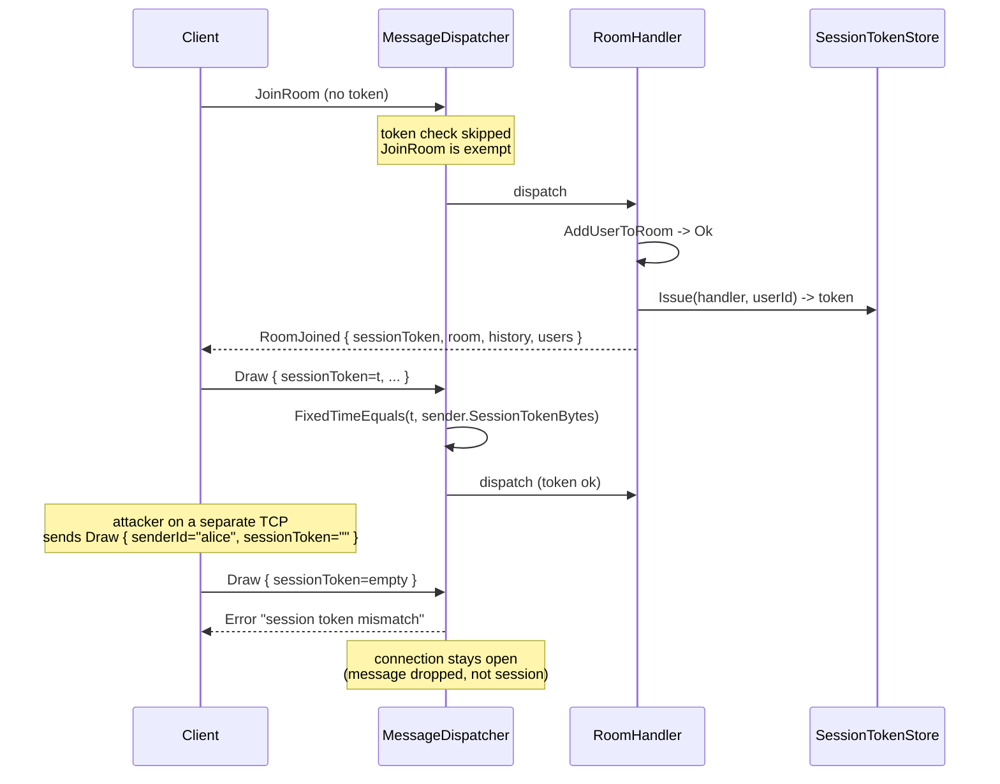

# Session token

## Elevator

Today an attacker on the same LAN who can reach the DrawServer on TCP 5000 can send any `NetMessage` with `senderId: "alice"` and the server will attribute that draw, chat, undo, or AI command to Alice. There is no proof that the sender of a message is the same TCP peer who originally joined as that user. After this change the server hands out a 256-bit random token in the `RoomJoined` reply, and every subsequent message from that connection must carry the same token in its envelope. Mismatch or absent token, the message is dropped with an `Error` and the connection survives. The `senderId` field becomes a display hint, not an identity claim.

## Threat model

What this defends against:

- Same-LAN passive attacker who has sniffed Alice's `senderId` and is forging messages from a separate TCP connection to the same server.
- Buggy or malicious client that constructs a `NetMessage` with an arbitrary `senderId` over its own (legitimately-joined) TCP connection — the token is bound to the connection, so the only `senderId` it can successfully forge is its own.
- Replay across connections: a recorded message from Alice's session cannot be sent on Eve's connection because the token won't match Eve's.

What this does not defend against:

- A network attacker who can read Alice's traffic in flight. The token travels in cleartext JSON over TCP; anyone on the wire sees it. TLS (separate work item) is the answer here, and the token is its prerequisite.
- A man-in-the-middle who can both read and inject on Alice's TCP stream — they get Alice's token directly and can trivially impersonate her. Same TLS dependency.
- Compromise of the server process. The token map is in-memory; an attacker with code execution on the server box already wins.
- Replay within the same connection. If the dispatcher has already accepted a message, replaying the exact bytes will be accepted again. Idempotency is a separate concern (most draw operations are idempotent by `DrawAction.Id`).

## Wire change

`NetMessage<T>` and `MessageEnvelope.Envelope` already carry a `version` field as of PR #8 (commit `0213436`, merged in `2e8e5aa`). The token is a sibling field in the same envelope:

```json
{
  "version": 2,
  "type": "Draw",
  "sessionToken": "k4_8r2VwQ1E…",
  "senderId": "alice",
  "senderName": "Alice",
  "roomId": "demo",
  "timestamp": 1746230400000,
  "payload": { ... }
}
```

`sessionToken` is a base64url-encoded 32-byte random string (no padding, ~43 chars). Field name is `sessionToken` to make grepping the protocol unambiguous; it sits next to `senderId` because the two are conceptually paired (claim + proof).

Bump `ProtocolVersion.Current` from 1 to 2 at the same time. This co-travels with the token requirement so a v1 client gets a single, clear `protocol version mismatch` error at the JoinRoom version check and the connection is closed (existing v1 behaviour from PR #8). If we left version at 1, a v1 client would pass the version gate and then get `session token missing` on its first draw, which is a worse error story for the demo.

The token field is not a bearer of cryptographic intent — there is no signature, no HMAC, no nonce. It is a server-issued random string that the server compares against its own table. Treat it the same as a session cookie in a web app: useful only because the server remembers it.

`MessageEnvelope.Envelope` gets a sixth field, `string SessionToken` (empty when absent). `MessageEnvelope.Parse` reads `jObject["sessionToken"]?.Value<string>() ?? string.Empty`. The `MessageReceived` event on `ClientHandler` is the right pivot point to refactor: today it is `Func<ClientHandler, MessageType, string, string, string, JObject?, Task>` with five stringly-typed positional params, and adding a sixth makes it worse. Pass the whole `Envelope` record instead. The dispatcher and handlers re-destructure as needed. This refactor is small (one event signature, one DrawServer wireup, one handler chain) and pays for itself the next time a field is added.

`TryBase64UrlDecode(string)` is a tiny helper added in this PR. Its contract: returns `null` for the empty string, whitespace-only input, any string containing characters outside the base64url alphabet, or any well-formed base64url that does not decode cleanly (e.g. wrong padding). Returns the decoded `byte[]` otherwise. There is no special path for "missing" vs "malformed" — the dispatcher treats both as mismatch and emits the same `Error`. This is intentional: distinguishing them does not help a legitimate client and would help a probing one.

**Broadcast path must strip the originator's token.** The dispatcher receives an `Envelope` carrying Alice's `sessionToken`. When `RoomService.BroadcastToRoomAsync` re-serializes that envelope to ship to Bob, Carol, etc., it MUST set `SessionToken = ""` on the outbound copy. Otherwise every Draw frame leaks Alice's auth token to every other room member in cleartext, and the spoof scenario this whole design is supposed to prevent becomes trivial for any legitimate room member. Same rule for any handler that constructs a server-side `NetMessage<T>` for fanout: the `Create` factory should default `SessionToken = ""` and the broadcast path should never copy the field from inbound envelopes. Add a unit test that joins two clients to one room, has one send a Draw, and asserts the other one's received envelope's `sessionToken` field is empty.

## Lifecycle

Issued in `RoomHandler.HandleJoinAsync`, after `AddUserToRoom` returns `JoinResult.Ok` and before the `RoomJoined` reply is sent. Generation:

```csharp
var bytes = new byte[32];
RandomNumberGenerator.Fill(bytes);
var token = Base64UrlEncode(bytes);
```

`RandomNumberGenerator.Fill` is the static convenience over `RandomNumberGenerator.Create()` — same CSPRNG, no `IDisposable` to forget.

Stored in a new `ISessionTokenStore` registered in DI alongside `IClientRegistry`. Concrete `SessionTokenStore` wraps `ConcurrentDictionary<string, SessionEntry>` keyed by token, where `SessionEntry` holds the byte[] for fixed-time compare, the `ClientHandler`, the `UserId`, and an `expiresAt` (used only by reconnect, see below). Token is also written to `ClientHandler.SessionToken` so the dispatcher can compare the inbound token against the connection's expected token without a dictionary lookup on the hot path.

Returned to the client in two places:

1. `RoomJoinedPayload` gains a `SessionToken` field. The client reads it from the payload, stores it in memory, and stamps it on every outbound `NetMessage` for the rest of the connection.
2. The `RoomJoined` envelope itself does NOT carry a `sessionToken` field on outbound messages — server-to-client direction has no need for it; the server already knows who it is sending to. Keep server-issued envelopes' `sessionToken` field empty/omitted.

Validated in `MessageDispatcher.DispatchAsync`, before handler dispatch, structurally parallel to the existing rate limiter. `JoinRoom` is exempt the same way `LeaveRoom` is exempt from rate-limiting today — the client cannot present a token before it has been issued one. All other message types must present a token that matches `sender.SessionToken`.

Compare:

```csharp
var expected = sender.SessionTokenBytes;
var presented = TryBase64UrlDecode(envelope.SessionToken);
if (expected is null || presented is null
    || presented.Length != expected.Length
    || !CryptographicOperations.FixedTimeEquals(presented, expected))
{
    await SendTokenMismatchError(sender, envelope.RoomId);
    return;
}
```

Length check before `FixedTimeEquals` is required: `FixedTimeEquals` throws on unequal-length spans. Length is not secret, so the early reject does not leak.

Expired:

- On TCP disconnect, `DrawServer.Disconnected` calls `_sessionTokenStore.MarkOrphaned(client)`, which sets `expiresAt = now + GraceWindow` (zero in v1 — see Phase 1) and detaches the `ClientHandler` reference.
- On clean `LeaveRoom`, the token is removed outright (no reconnect grace).
- On server restart everything is gone — tokens live nowhere but RAM.

Sequence:



## Edge cases

Token absent on a non-JoinRoom message (v2 client bug, or a v1 client that slipped past the version check somehow): treated identically to mismatch. `Error` with message `session token missing or invalid`, machine code `AUTH_TOKEN_MISMATCH`, message dropped, TCP stays up. The error reply reuses the rate limiter's `_lastRejectReply` cooldown by design — a connection that legitimately tripped both rate-limit and a token mismatch in the same second sees only one of the two errors, but the savings of one shared cooldown field over two outweighs the diagnostic loss for a uni demo. If a future need arises to keep them separate, split into `_lastTokenRejectReply` and `_lastRateRejectReply`.

Stale token (server restarted, client reconnected with old token from before the restart): the in-memory store has no entry, so `sender.SessionTokenBytes` is null. Treated as mismatch. Client should react to the `Error` by re-issuing JoinRoom, which gets it a fresh token.

Same UserId re-joins on the same TCP connection (existing behaviour: client sends a second JoinRoom to switch rooms): the existing token is kept. The store is keyed by token, not by user, and the connection's `SessionToken` field is not rewritten on a successful room switch. This matches "token is per-TCP-connection". A client that wants to fully reset can drop its TCP and reconnect.

Concretely, `ClientHandler.SessionTokenBytes` is set exactly once per `ClientHandler` lifetime — assigned in `RoomHandler.HandleJoinAsync` only when the field is currently null, never rewritten afterwards. The dispatcher reads it lock-free on the message-receive thread. This works because the field is reference-typed and the assignment happens-before the first message that could observe it (the JoinRoom reply is sent only after the assignment, and the client cannot race a Draw past its own JoinRoom-reply read). On the room-switch path the assignment is skipped entirely (field already non-null), so the lock-free read remains safe.

Same UserId re-joins on a NEW TCP connection while the original is still alive: this is the spoof scenario, not the reconnect scenario. The new connection has no token (it is sending JoinRoom), so it goes through the normal JoinRoom path and gets issued its own fresh token tied to its own connection. The original connection's token is unaffected and still works for the original connection. Both connections now exist with the same `UserId` — the room service will see two clients with `senderId: "alice"`. That is a separate problem (duplicate-user policy: kick the older, refuse the newer, allow both with disambiguation) and explicitly out of scope here. The token mechanism is doing its job: each connection's identity claim is independently provable.

Second connection presents a stolen token concurrently with the original connection still alive: lookup in the token store finds the existing `SessionEntry` whose `ClientHandler` is the original (alive) connection. The dispatcher only checks `sender.SessionTokenBytes` against the inbound token, where `sender` is the connection the message arrived on. The thief's connection has its own (different or empty) `SessionToken`, so the compare fails. The store-side lookup happens only on reconnect (Phase 2), where it is gated on the original connection being dead.

Reconnect-during-grace where two reconnect attempts race: the store's `TryClaim(token)` is a single `ConcurrentDictionary` operation. First wins, second sees the entry already attached and is rejected with the same `Error`. No partial reattach state.

## Reconnect-readiness

The seam P8.T1 needs is the `SessionTokenStore` and a single method on it:

```csharp
bool TryClaim(string token, ClientHandler newHandler, out string userId);
```

Contract: returns true and rebinds the entry's `ClientHandler` to `newHandler` if and only if (a) the token is in the store, (b) `expiresAt` has not yet passed, (c) the existing `ClientHandler` is null (orphaned by a prior disconnect). On success, `userId` is the original UserId and the new connection's `SessionToken` is set to the same token. On failure, the token is treated as unknown.

P8.T1 wires this into a new `Resume` message type or piggybacks on JoinRoom with a token parameter — that is their call. Phase 1 deliberately sets `GraceWindow = TimeSpan.Zero` so `MarkOrphaned` removes the entry immediately and `TryClaim` always returns false. Phase 2 flips the grace window to a configurable value (proposal: 30s, env var `SESSION_RESUME_GRACE_SECONDS`).

What is fixed by Phase 1 and must not be redesigned by Phase 2:

- Token is the resume credential. There is no separate "resume id" field on the wire.
- The store is keyed by token (not UserId). Two simultaneously-orphaned sessions for the same UserId stay distinct.
- Token lifetime is bounded by the grace window. A token that has been issued, used, and orphaned past expiry is gone forever; the client must JoinRoom fresh.

## Phases

**Phase 1 — issue and validate.** Add `ProtocolVersion.Current = 2`. Add `sessionToken` field to `NetMessage<T>` and `MessageEnvelope.Envelope`. Refactor `ClientHandler.MessageReceived` to pass the `Envelope` record. Add `SessionTokenStore` keyed by token. Issue a token in `RoomHandler.HandleJoinAsync` after `JoinResult.Ok`, return it in `RoomJoinedPayload`, store it on `ClientHandler.SessionToken` / `SessionTokenBytes`. Validate in `MessageDispatcher.DispatchAsync` with `FixedTimeEquals`, `JoinRoom` exempt. Reuse the rate-limiter's `_lastRejectReply` cooldown for the error reply. Strip `SessionToken` on every server-out envelope (broadcast and direct reply). Add `string Code` to `ErrorPayload` and emit `AUTH_TOKEN_MISMATCH`, `PROTOCOL_VERSION`, `RATE_LIMITED` from the three existing error sites. Update WPF client to capture the token from `RoomJoined` and stamp it on outbound messages. `GraceWindow = TimeSpan.Zero`. Estimate: 2 days.

**Phase 2 — reconnect resume.** Owned by P8.T1. Flip `GraceWindow` to a configurable non-zero value, implement `TryClaim`, add a `Resume` path (either new message type or JoinRoom-with-token). The Phase 1 store API does not change shape. Estimate: 2 days, separate PR, separate owner.

## Open questions

1. Should the WPF client persist the token across an in-process room switch (client-driven `JoinRoom` to a new room on the same TCP)? Recommendation: yes, since the server keeps it. Needs confirmation from whoever owns `MainWindow.ProcessMessage`.
2. `RoomJoined` is currently sent with `senderId: "server"`. Is that envelope itself eligible for token validation in either direction? Recommendation: server-to-client envelopes are not validated; the client trusts the TCP stream. If we ever flip this we want mutual auth, which is a different design.
3. Token regeneration on long-lived connections — should the server proactively rotate the token after N hours? Recommendation: not in v1. Connection lifetime is short in practice (drawing sessions), and rotation adds a server-push path we do not have.
4. For testing, do we want a `SESSION_TOKEN_DISABLE=1` env var to short-circuit validation in dev, or is the integration test harness happy to do a real handshake? Recommendation: no env-var bypass; the harness already issues real JoinRooms.

## Out of scope

- TLS / wire encryption. Token still flows in cleartext after this PR. Tracked separately.
- Certificate-based or OAuth client authentication. The token is a server-issued opaque random string, not a credential the client brings.
- Persistent identity across server restarts. Token store is in-memory only.
- Per-message signing (HMAC over the envelope). The token is a bearer token, not a key.
- Rate-limiting tightening, capacity caps, or duplicate-UserId policy. Those are independent defenses and remain in their own PRs.
- Audit logging of mismatches beyond the existing `_logger.LogWarning` for unknown handlers. A real audit trail is a separate observability story.
- Reconnect resume itself (Phase 2 / P8.T1). This PR only leaves the seam.
